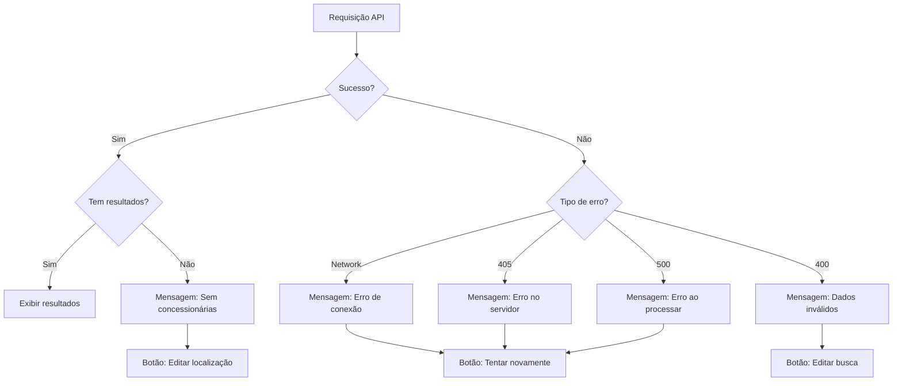

# Design Document - API Routing Fix

## Overview

Este design resolve o problema de roteamento de API entre desenvolvimento e produção, garantindo que requisições funcionem consistentemente em ambos os ambientes. A solução envolve ajustes no proxy do Vite, configuração de variáveis de ambiente, e melhorias no tratamento de erros.

## Architecture

### Current State (Problema)

```
DESENVOLVIMENTO:
Frontend (localhost:3000) → Proxy Vite → Backend (localhost:8000)
  /api/recommend         remove /api      /recommend ✅

PRODUÇÃO:
Frontend (Railway) → Backend (Railway)
  /api/recommend      →  /api/recommend ❌ (não existe)
```

### Target State (Solução)

```
DESENVOLVIMENTO:
Frontend (localhost:3000) → Proxy Vite → Backend (localhost:8000)
  /recommend                             /recommend ✅

PRODUÇÃO:
Frontend (Railway) → Backend (Railway)
  /recommend         →  /recommend ✅
```

## Components and Interfaces

### 1. API Service Layer (`platform/frontend/src/services/api.ts`)

**Mudanças:**
- Remover prefixo `/api` de todas as chamadas
- Usar `baseURL` configurável via variável de ambiente
- Adicionar logging detalhado de requisições
- Melhorar tratamento de erros com mensagens específicas

**Interface:**
```typescript
// Configuração do axios
const api: AxiosInstance = axios.create({
    baseURL: import.meta.env.VITE_API_URL || 'http://localhost:8000',
    timeout: 30000,
    headers: {
        'Content-Type': 'application/json',
    },
})

// Interceptor de request para logging
api.interceptors.request.use(
    config => {
        console.log(`[API Request] ${config.method?.toUpperCase()} ${config.baseURL}${config.url}`)
        return config
    }
)

// Interceptor de response melhorado
api.interceptors.response.use(
    response => {
        console.log(`[API Response] ${response.status} ${response.config.url}`)
        return response
    },
    (error: AxiosError<ApiError>) => {
        // Tratamento específico por tipo de erro
        if (error.code === 'ECONNABORTED') {
            // Timeout
        } else if (error.response?.status === 405) {
            // Method not allowed
        } else if (error.response?.status === 500) {
            // Server error
        }
        return Promise.reject(apiError)
    }
)
```

### 2. Vite Configuration (`platform/frontend/vite.config.ts`)

**Mudanças:**
- Remover rewrite do proxy (não remover `/api`)
- Simplificar configuração do proxy

**Configuração:**
```typescript
export default defineConfig({
    server: {
        port: 3000,
        proxy: {
            '/api': {
                target: 'http://localhost:8000',
                changeOrigin: true,
                // REMOVER: rewrite: (path) => path.replace(/^\/api/, ''),
            },
        },
    },
})
```

**Alternativa (Recomendada):**
Remover proxy completamente e usar `VITE_API_URL`:
```typescript
export default defineConfig({
    server: {
        port: 3000,
        // Sem proxy - usar variável de ambiente
    },
})
```

### 3. Backend Routes (`platform/backend/api/main.py`)

**Mudanças:**
- Adicionar prefixo `/api` a todas as rotas
- Manter rotas sem prefixo para compatibilidade (deprecated)
- Melhorar resposta quando não há concessionárias

**Implementação:**
```python
# Rotas com prefixo /api (NOVO)
@app.post("/api/recommend")
def recommend_cars_api(profile: UserProfile):
    return recommend_cars(profile)

# Rotas sem prefixo (MANTER para compatibilidade)
@app.post("/recommend")
def recommend_cars(profile: UserProfile):
    try:
        recommendations = engine.recommend(profile, limit=3, score_threshold=0.2)
        
        # Se não há recomendações, retornar 200 com lista vazia
        if not recommendations:
            return {
                "total_recommendations": 0,
                "profile_summary": {...},
                "recommendations": [],
                "message": "Nenhuma concessionária disponível nesta região"
            }
        
        return {...}
    except Exception as e:
        # Logging detalhado
        print(f"[ERROR] /recommend: {str(e)}")
        raise HTTPException(status_code=500, detail=str(e))
```

### 4. Environment Configuration

**Desenvolvimento (`.env.development`):**
```env
VITE_API_URL=http://localhost:8000
```

**Produção (Railway):**
```env
VITE_API_URL=https://faciliauto-backend-production.up.railway.app
```

### 5. Results Page Error Handling (`platform/frontend/src/pages/ResultsPage.tsx`)

**Mudanças:**
- Melhorar mensagens de erro
- Adicionar sugestões específicas por tipo de erro
- Oferecer ações claras ao usuário

**Implementação:**
```typescript
// Estado de erro
const [error, setError] = useState<{
    type: 'network' | 'no_dealerships' | 'server' | 'unknown'
    message: string
    details?: string
} | null>(null)

// Tratamento de erro na requisição
try {
    const data = await getRecommendations(profile)
    
    if (data.total_recommendations === 0) {
        setError({
            type: 'no_dealerships',
            message: 'Nenhuma concessionária disponível',
            details: `Não encontramos concessionárias em ${profile.state}`
        })
    }
} catch (err) {
    if (err.code === 'ECONNABORTED') {
        setError({
            type: 'network',
            message: 'Erro de conexão',
            details: 'Não foi possível conectar ao servidor'
        })
    } else if (err.status === 405) {
        setError({
            type: 'server',
            message: 'Erro no servidor',
            details: 'Problema de configuração da API'
        })
    }
}
```

## Data Models

### API Error Response
```typescript
interface ApiError {
    message: string
    detail?: string
    status: number
    code?: string // 'ECONNABORTED', 'NETWORK_ERROR', etc
}
```

### Empty Recommendations Response
```typescript
interface RecommendationResponse {
    total_recommendations: number
    profile_summary: ProfileSummary
    recommendations: Recommendation[]
    message?: string // Mensagem quando lista vazia
    suggested_states?: string[] // Estados próximos com concessionárias
}
```

## Error Handling

### Error Types and Messages

| Error Type | Status | User Message | Action |
|------------|--------|--------------|--------|
| Network Timeout | - | "Servidor não respondeu. Verifique sua conexão." | Retry button |
| 405 Method Not Allowed | 405 | "Erro no servidor. Nossa equipe foi notificada." | Retry + Contact support |
| 500 Server Error | 500 | "Erro ao processar sua busca. Tente novamente." | Retry button |
| 400 Bad Request | 400 | Mensagem específica do backend | Edit search |
| No Dealerships | 200 | "Nenhuma concessionária em [Estado]" | Edit location |

### Error Recovery Flow



## Testing Strategy

### Unit Tests

1. **API Service Tests** (`api.test.ts`)
   - Testar configuração de baseURL em diferentes ambientes
   - Testar interceptors de request/response
   - Testar tratamento de erros por tipo
   - Testar retry logic

2. **Results Page Tests** (`ResultsPage.test.tsx`)
   - Testar exibição de mensagem quando sem concessionárias
   - Testar exibição de erro de rede
   - Testar botões de ação (retry, edit)
   - Testar logging de erros

### Integration Tests

1. **API Routing** (Cypress)
   - Testar requisição `/recommend` em dev
   - Testar requisição `/recommend` em produção
   - Testar resposta quando sem concessionárias
   - Testar CORS headers

2. **Error Scenarios** (Cypress)
   - Simular timeout de rede
   - Simular erro 405
   - Simular erro 500
   - Verificar mensagens exibidas ao usuário

### Manual Testing Checklist

- [ ] Desenvolvimento: Requisição funciona em localhost
- [ ] Produção: Requisição funciona no Railway
- [ ] Estado sem concessionárias: Mensagem clara exibida
- [ ] Erro de rede: Mensagem e botão retry funcionam
- [ ] Logs: Requisições são logadas corretamente
- [ ] Environment: Variáveis de ambiente carregam corretamente

## Implementation Notes

### Ordem de Implementação

1. **Backend**: Adicionar rotas com prefixo `/api`
2. **Frontend**: Atualizar `api.ts` para remover prefixo `/api` das chamadas
3. **Vite**: Simplificar ou remover proxy
4. **Environment**: Configurar variáveis de ambiente
5. **Error Handling**: Melhorar tratamento de erros
6. **Testing**: Validar em dev e produção

### Rollback Plan

Se houver problemas:
1. Reverter mudanças no `api.ts` (adicionar `/api` de volta)
2. Manter proxy do Vite com rewrite
3. Investigar problema específico
4. Aplicar fix incremental

### Monitoring

Adicionar logs para monitorar:
- Taxa de erro 405 (deve ir para 0)
- Requisições para estados sem concessionárias
- Tempo de resposta da API
- Erros de rede vs erros de servidor

## Design Decisions

### Decisão 1: Remover prefixo `/api` do frontend

**Opções consideradas:**
- A) Adicionar `/api` no backend
- B) Remover `/api` do frontend
- C) Manter ambos e usar proxy em produção

**Escolha:** B - Remover `/api` do frontend

**Razão:** 
- Mais simples e direto
- Menos configuração necessária
- Backend já não usa prefixo `/api`
- Evita necessidade de proxy em produção

### Decisão 2: Retornar 200 com lista vazia vs 404

**Opções consideradas:**
- A) Retornar 404 quando sem concessionárias
- B) Retornar 200 com lista vazia

**Escolha:** B - Retornar 200 com lista vazia

**Razão:**
- Não é um erro - é um resultado válido
- Permite frontend tratar de forma mais elegante
- Facilita adicionar mensagens contextuais
- Segue padrão REST para coleções vazias

### Decisão 3: Variável de ambiente vs hardcoded URL

**Opções consideradas:**
- A) Hardcoded URL em produção
- B) Variável de ambiente
- C) Auto-detect baseado em window.location

**Escolha:** B - Variável de ambiente

**Razão:**
- Mais flexível para diferentes ambientes
- Facilita testes
- Segue best practices
- Railway suporta nativamente
