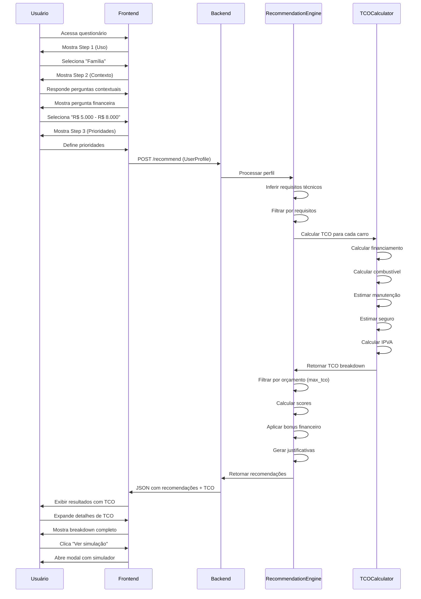

# Design: Questionário Simplificado com Capacidade Financeira

## 📋 Visão Geral

Este documento detalha o design técnico para implementar um questionário simplificado que usa linguagem acessível e captura a capacidade financeira do usuário para recomendar carros dentro do orçamento.

## 🎯 Objetivos de Design

1. **Integração Suave**: Adicionar pergunta de capacidade financeira no questionário existente (Step 2)
2. **Linguagem Simples**: Manter a filosofia de linguagem acessível do questionário atual
3. **Inferência Inteligente**: Traduzir faixa salarial em TCO máximo recomendado
4. **Capacidade Financeira**: Calcular TCO e filtrar carros por orçamento
5. **Privacidade**: Garantir segurança dos dados financeiros (opcional, não persistido)
6. **UX Mobile-First**: Interface consistente com o design atual

---

## 🏗️ Arquitetura

### Componentes Principais

```
┌─────────────────────────────────────────────────────────────┐
│                    Frontend (React)                          │
├─────────────────────────────────────────────────────────────┤
│  QuestionnaireFlow (EXISTENTE)                              │
│  ├── Step1: Budget (Orçamento)                              │
│  ├── Step2: Usage (Uso e Família) - MODIFICAR               │
│  │   ├── UsageProfileSelector (existente)                   │
│  │   ├── FamilyComposition (existente)                      │
│  │   └── FinancialCapacityQuestion (NEW) ← ADICIONAR AQUI   │
│  ├── Step3: Priorities (Prioridades)                        │
│  └── Step4: Preferences (Preferências)                      │
└─────────────────────────────────────────────────────────────┘
                            ↓ HTTP POST
┌─────────────────────────────────────────────────────────────┐
│                    Backend (FastAPI)                         │
├─────────────────────────────────────────────────────────────┤
│  RequirementInferenceEngine                                  │
│  ├── SimpleToTechnicalMapper                                │
│  ├── ContextualRuleEngine                                   │
│  └── FinancialConstraintCalculator (NEW)                    │
│                                                              │
│  TCOCalculator (NEW)                                         │
│  ├── FinancingCalculator                                    │
│  ├── FuelCostEstimator                                      │
│  ├── MaintenanceCostEstimator                               │
│  ├── InsuranceCostEstimator                                 │
│  └── IPVACalculator                                         │
│                                                              │
│  UnifiedRecommendationEngine (Enhanced)                      │
│  ├── TechnicalFiltering                                     │
│  ├── FinancialFiltering (NEW)                               │
│  ├── ScoringAlgorithm                                       │
│  └── ResultsFormatter                                       │
└─────────────────────────────────────────────────────────────┘
```

---

## � Integraçãeo com Questionário Existente

### Estrutura Atual do Questionário

O FacilIAuto já possui um questionário de 4 steps:

1. **Step 1: Budget** - Orçamento e localização
2. **Step 2: Usage** - Uso principal e composição familiar ← **ADICIONAR PERGUNTA AQUI**
3. **Step 3: Priorities** - Prioridades (5 sliders)
4. **Step 4: Preferences** - Preferências de marca, categoria, etc.

### Modificações Necessárias

#### 1. Frontend: Step2Usage.tsx

**Adicionar** nova seção no final do componente, após as perguntas sobre família:

```tsx
// Localização: platform/frontend/src/components/questionnaire/Step2Usage.tsx
// Adicionar após a seção "Composição Familiar"

<Divider />

{/* Nova seção: Capacidade Financeira */}
<VStack spacing={6} align="stretch">
  <VStack spacing={2} align="flex-start">
    <Heading size="md" color="gray.800">
      💰 Qual seu orçamento mensal?
    </Heading>
    <Text fontSize="sm" color="gray.600">
      (opcional) Ajuda a recomendar carros que cabem no seu bolso
    </Text>
  </VStack>
  
  {/* Implementação da pergunta de faixa salarial */}
  {/* Ver seção "Interface de Usuário" para código completo */}
</VStack>
```

#### 2. Store: questionnaireStore.ts

**Adicionar** campo `faixa_salarial` ao estado:

```typescript
// Localização: platform/frontend/src/store/questionnaireStore.ts

interface QuestionnaireState {
  // Campos existentes...
  uso_principal?: UsoPrincipal
  tamanho_familia?: number
  tem_criancas?: boolean
  tem_idosos?: boolean
  
  // NOVO: Capacidade financeira
  faixa_salarial?: string | null  // "0-3000", "3000-5000", etc.
}
```

#### 3. Backend: user_profile.py

**Adicionar** campo `financial_capacity` ao modelo:

```python
# Localização: platform/backend/models/user_profile.py

class FinancialCapacity(BaseModel):
    """Capacidade financeira do usuário"""
    monthly_income_range: Optional[str] = None
    max_monthly_tco: Optional[float] = None
    is_disclosed: bool = False

class UserProfile(BaseModel):
    # Campos existentes...
    usage_type: str
    priorities: Dict[str, int]
    
    # NOVO
    financial_capacity: Optional[FinancialCapacity] = None
```

#### 4. Backend: unified_recommendation_engine.py

**Modificar** para considerar capacidade financeira na filtragem e scoring.

---

## 📊 Modelos de Dados


### UserProfile (Enhanced)

```python
class FinancialCapacity(BaseModel):
    """Capacidade financeira do usuário"""
    monthly_income_range: Optional[str] = None  # "3000-5000", "5000-8000", etc.
    max_monthly_tco: Optional[float] = None     # Calculado: 30% da renda média
    is_disclosed: bool = False                   # Se usuário informou ou pulou
    
class UserProfile(BaseModel):
    """Perfil completo do usuário"""
    # Existente
    usage_type: str
    priorities: Dict[str, int]
    contextual_answers: Dict[str, Any]
    
    # Novo
    financial_capacity: Optional[FinancialCapacity] = None
```

### TCOBreakdown (New)

```python
class TCOBreakdown(BaseModel):
    """Detalhamento do custo total de propriedade"""
    financing_monthly: float        # Parcela do financiamento
    fuel_monthly: float             # Combustível estimado
    maintenance_monthly: float      # Manutenção média
    insurance_monthly: float        # Seguro anual / 12
    ipva_monthly: float             # IPVA anual / 12
    total_monthly: float            # Soma de todos
    
    # Metadados para cálculo
    assumptions: Dict[str, Any] = {
        "down_payment_percent": 20,
        "financing_months": 60,
        "monthly_km": 1000,
        "fuel_price_per_liter": 5.20,
        "state": "SP"  # Para IPVA
    }
```

### CarRecommendation (Enhanced)

```python
class CarRecommendation(BaseModel):
    """Recomendação de carro com informações financeiras"""
    # Existente
    car: Car
    score: float
    justifications: List[str]
    
    # Novo
    tco_breakdown: Optional[TCOBreakdown] = None
    fits_budget: Optional[bool] = None
    budget_percentage: Optional[float] = None  # % da renda que representa
```

---

## 🔄 Fluxo de Dados

### 1. Captura de Capacidade Financeira

```
User selects income range
        ↓
Frontend validates selection
        ↓
Calculate max_monthly_tco = avg(range) * 0.30
        ↓
Store in UserProfile.financial_capacity
        ↓
Send to backend with recommendation request
```

### 2. Cálculo de TCO por Carro

```
For each car in inventory:
    ↓
Calculate financing_monthly
    = (price * 0.80) / 60 months
    ↓
Calculate fuel_monthly
    = (monthly_km / fuel_efficiency) * fuel_price
    ↓
Estimate maintenance_monthly
    = category_avg_maintenance / 12
    ↓
Estimate insurance_monthly
    = get_insurance_estimate(car) / 12
    ↓
Calculate ipva_monthly
    = (price * state_rate) / 12
    ↓
total_monthly = sum(all_components)
```

### 3. Filtragem Financeira

```
If user disclosed financial_capacity:
    ↓
Filter cars where:
    tco_breakdown.total_monthly <= max_monthly_tco * 1.1
    (10% tolerance)
    ↓
Sort by fit (closer to budget = better)
```

---

## 🎨 Interface de Usuário


### Pergunta de Capacidade Financeira (Adicionar no Step2Usage)

**Localização**: Adicionar no final do componente `Step2Usage.tsx`, após as perguntas sobre família.

```tsx
{/* Nova seção: Capacidade Financeira */}
<Divider />

<VStack spacing={6} align="stretch">
  <VStack spacing={2} align="flex-start">
    <Heading size="md" color="gray.800">
      💰 Qual seu orçamento mensal?
    </Heading>
    <Text fontSize="sm" color="gray.600">
      (opcional) Ajuda a recomendar carros que cabem no seu bolso
    </Text>
  </VStack>

  {/* Privacy Badge */}
  <Alert status="info" borderRadius="md" variant="left-accent">
    <AlertIcon as={FaLock} />
    <Box>
      <AlertTitle fontSize="sm">Seus dados são seguros</AlertTitle>
      <AlertDescription fontSize="xs">
        Não salvamos ou compartilhamos suas informações financeiras
      </AlertDescription>
    </Box>
  </Alert>

  {/* Income Range Selector */}
  <FormControl>
    <FormLabel fontSize="md" fontWeight="semibold">
      Qual sua renda mensal líquida?
    </FormLabel>
    
    <RadioGroup
      value={formData.faixa_salarial || ''}
      onChange={(value) => updateFormData({ faixa_salarial: value })}
    >
      <VStack spacing={3} align="stretch">
        <Radio value="0-3000" size="lg">
          <HStack justify="space-between" w="full">
            <Text>Até R$ 3.000</Text>
            <Text fontSize="xs" color="gray.500">
              TCO até R$ 900/mês
            </Text>
          </HStack>
        </Radio>
        
        <Radio value="3000-5000" size="lg">
          <HStack justify="space-between" w="full">
            <Text>R$ 3.000 - R$ 5.000</Text>
            <Text fontSize="xs" color="gray.500">
              TCO até R$ 1.500/mês
            </Text>
          </HStack>
        </Radio>
        
        <Radio value="5000-8000" size="lg">
          <HStack justify="space-between" w="full">
            <Text>R$ 5.000 - R$ 8.000</Text>
            <Text fontSize="xs" color="gray.500">
              TCO até R$ 2.400/mês
            </Text>
          </HStack>
        </Radio>
        
        <Radio value="8000-12000" size="lg">
          <HStack justify="space-between" w="full">
            <Text>R$ 8.000 - R$ 12.000</Text>
            <Text fontSize="xs" color="gray.500">
              TCO até R$ 3.600/mês
            </Text>
          </HStack>
        </Radio>
        
        <Radio value="12000+" size="lg">
          <HStack justify="space-between" w="full">
            <Text>Acima de R$ 12.000</Text>
            <Text fontSize="xs" color="gray.500">
              TCO até R$ 5.000/mês
            </Text>
          </HStack>
        </Radio>
      </VStack>
    </RadioGroup>
    
    <Button
      variant="link"
      size="sm"
      mt={2}
      onClick={() => updateFormData({ faixa_salarial: null })}
    >
      Prefiro não informar
    </Button>
  </FormControl>

  {/* Privacy Link */}
  <Link
    fontSize="xs"
    color="blue.600"
    onClick={() => setShowPrivacyModal(true)}
  >
    Como usamos seus dados? 🔒
  </Link>
</VStack>
```

### Exibição de TCO nos Resultados

```tsx
<CarCard>
  <CarImage />
  <CarTitle />
  <Score />
  
  {/* Novo: TCO Breakdown */}
  <TCOSection>
    <TCOHeader>
      <Icon>💰</Icon>
      <Title>Custo mensal estimado</Title>
      <TotalAmount>R$ 2.267/mês</TotalAmount>
      {fits_budget && <Badge color="green">✓ Cabe no seu orçamento</Badge>}
      {!fits_budget && <Badge color="orange">⚠ Acima do recomendado</Badge>}
    </TCOHeader>
    
    <TCOBreakdown collapsible>
      <TCOItem>
        <Icon>🏦</Icon>
        <Label>Parcela do financiamento</Label>
        <Amount>R$ 1.400</Amount>
        <Hint>60x com 20% de entrada</Hint>
      </TCOItem>
      
      <TCOItem>
        <Icon>⛽</Icon>
        <Label>Combustível</Label>
        <Amount>R$ 400</Amount>
        <Hint>1.000 km/mês, 13 km/L</Hint>
      </TCOItem>
      
      <TCOItem>
        <Icon>🔧</Icon>
        <Label>Manutenção</Label>
        <Amount>R$ 150</Amount>
        <Hint>Média anual R$ 1.800</Hint>
      </TCOItem>
      
      <TCOItem>
        <Icon>🛡️</Icon>
        <Label>Seguro</Label>
        <Amount>R$ 200</Amount>
        <Hint>Estimativa anual R$ 2.400</Hint>
      </TCOItem>
      
      <TCOItem>
        <Icon>📋</Icon>
        <Label>IPVA</Label>
        <Amount>R$ 117</Amount>
        <Hint>4% do valor (SP)</Hint>
      </TCOItem>
    </TCOBreakdown>
    
    <BudgetIndicator>
      <Label>Representa {budget_percentage}% da sua renda</Label>
      <ProgressBar value={budget_percentage} max={40} />
      <Hint>Recomendado: até 30%</Hint>
    </BudgetIndicator>
    
    <SimulationButton>Ver simulação completa</SimulationButton>
  </TCOSection>
  
  <Justifications />
  <ContactButton />
</CarCard>
```

---

## 🧮 Algoritmos de Cálculo


### 1. Cálculo de TCO Máximo

```python
def calculate_max_monthly_tco(income_range: str) -> float:
    """
    Calcula TCO máximo baseado em 30% da renda média da faixa
    
    Args:
        income_range: String no formato "3000-5000" ou "12000+"
        
    Returns:
        TCO máximo mensal em reais
    """
    income_brackets = {
        "0-3000": (0, 3000),
        "3000-5000": (3000, 5000),
        "5000-8000": (5000, 8000),
        "8000-12000": (8000, 12000),
        "12000+": (12000, 16000)  # Assumir teto de 16k para cálculo
    }
    
    min_income, max_income = income_brackets[income_range]
    avg_income = (min_income + max_income) / 2
    
    # 30% da renda média
    max_tco = avg_income * 0.30
    
    return max_tco
```

### 2. Cálculo de Financiamento

```python
def calculate_financing_monthly(
    car_price: float,
    down_payment_percent: float = 0.20,
    months: int = 60,
    annual_interest_rate: float = 0.12
) -> float:
    """
    Calcula parcela mensal do financiamento usando Price
    
    Args:
        car_price: Preço do carro
        down_payment_percent: Percentual de entrada (padrão 20%)
        months: Número de parcelas (padrão 60)
        annual_interest_rate: Taxa anual (padrão 12%)
        
    Returns:
        Valor da parcela mensal
    """
    financed_amount = car_price * (1 - down_payment_percent)
    monthly_rate = annual_interest_rate / 12
    
    # Fórmula Price
    if monthly_rate > 0:
        monthly_payment = financed_amount * (
            monthly_rate * (1 + monthly_rate) ** months
        ) / (
            (1 + monthly_rate) ** months - 1
        )
    else:
        monthly_payment = financed_amount / months
    
    return monthly_payment
```

### 3. Cálculo de Combustível

```python
def calculate_fuel_monthly(
    monthly_km: int,
    fuel_efficiency_km_per_liter: float,
    fuel_price_per_liter: float = 5.20
) -> float:
    """
    Calcula custo mensal de combustível
    
    Args:
        monthly_km: Quilometragem mensal estimada
        fuel_efficiency_km_per_liter: Consumo do carro (km/L)
        fuel_price_per_liter: Preço do combustível (padrão R$ 5,20)
        
    Returns:
        Custo mensal de combustível
    """
    liters_needed = monthly_km / fuel_efficiency_km_per_liter
    monthly_cost = liters_needed * fuel_price_per_liter
    
    return monthly_cost
```

### 4. Estimativa de Manutenção

```python
def estimate_maintenance_monthly(car_category: str, car_age: int = 0) -> float:
    """
    Estima custo mensal de manutenção baseado em categoria
    
    Args:
        car_category: Categoria do carro (Hatch, Sedan, SUV, etc.)
        car_age: Idade do carro em anos (0 = novo)
        
    Returns:
        Custo mensal estimado de manutenção
    """
    # Custo anual base por categoria (dados de mercado)
    base_annual_costs = {
        "Hatch": 1500,
        "Sedan Compacto": 1800,
        "Sedan": 2200,
        "SUV Compacto": 2500,
        "SUV": 3000,
        "Pickup": 2800,
        "Van": 3200,
        "Furgão": 2600
    }
    
    base_cost = base_annual_costs.get(car_category, 2000)
    
    # Ajuste por idade (aumenta 10% por ano)
    age_multiplier = 1 + (car_age * 0.10)
    
    annual_cost = base_cost * age_multiplier
    monthly_cost = annual_cost / 12
    
    return monthly_cost
```

### 5. Estimativa de Seguro

```python
def estimate_insurance_monthly(
    car_price: float,
    car_category: str,
    user_profile: str = "standard"
) -> float:
    """
    Estima custo mensal de seguro
    
    Args:
        car_price: Preço do carro
        car_category: Categoria do carro
        user_profile: Perfil do segurado (standard, young, senior)
        
    Returns:
        Custo mensal estimado de seguro
    """
    # Taxa base por categoria (% do valor do carro)
    category_rates = {
        "Hatch": 0.035,          # 3.5% ao ano
        "Sedan Compacto": 0.040,
        "Sedan": 0.045,
        "SUV Compacto": 0.050,
        "SUV": 0.055,
        "Pickup": 0.048,
        "Van": 0.052,
        "Furgão": 0.045
    }
    
    base_rate = category_rates.get(car_category, 0.045)
    
    # Ajuste por perfil
    profile_multipliers = {
        "standard": 1.0,
        "young": 1.3,      # Jovens pagam mais
        "senior": 0.9      # Idosos pagam menos
    }
    
    multiplier = profile_multipliers.get(user_profile, 1.0)
    
    annual_cost = car_price * base_rate * multiplier
    monthly_cost = annual_cost / 12
    
    return monthly_cost
```

### 6. Cálculo de IPVA

```python
def calculate_ipva_monthly(car_price: float, state: str = "SP") -> float:
    """
    Calcula IPVA mensal baseado no estado
    
    Args:
        car_price: Preço do carro
        state: Estado (padrão SP)
        
    Returns:
        IPVA mensal
    """
    # Alíquotas por estado (2025)
    state_rates = {
        "SP": 0.04,   # 4%
        "RJ": 0.04,
        "MG": 0.04,
        "RS": 0.03,
        "PR": 0.035,
        "SC": 0.02,
        # ... outros estados
    }
    
    rate = state_rates.get(state, 0.04)
    annual_ipva = car_price * rate
    monthly_ipva = annual_ipva / 12
    
    return monthly_ipva
```

---

## 🔍 Mapeamento: Linguagem Simples → Requisitos Técnicos


### SimpleToTechnicalMapper

```python
class SimpleToTechnicalMapper:
    """Mapeia respostas simples para requisitos técnicos"""
    
    def __init__(self):
        self.mapping_rules = {
            # Família
            "has_small_children": {
                "yes": {
                    "required_features": ["ISOFIX"],
                    "min_airbags": 6,
                    "safety_priority": 5
                }
            },
            "has_elderly": {
                "yes": {
                    "min_ground_clearance": 180,  # mm
                    "preferred_categories": ["SUV", "SUV Compacto"]
                }
            },
            "long_trips": {
                "frequently": {
                    "min_trunk_capacity": 400,  # litros
                    "comfort_priority": 5
                },
                "sometimes": {
                    "min_trunk_capacity": 300
                }
            },
            
            # Trabalho
            "monthly_km": {
                "2000+": {
                    "min_fuel_efficiency": 13,  # km/L
                    "economy_priority": 5
                },
                "1000-2000": {
                    "min_fuel_efficiency": 12
                }
            },
            
            # Primeiro Carro
            "is_first_car": {
                "yes": {
                    "preferred_categories": ["Hatch", "Sedan Compacto"],
                    "max_length": 4200,  # mm
                    "ease_of_driving": True
                }
            },
            
            # Capacidade Financeira (NEW)
            "income_range": {
                "0-3000": {
                    "max_monthly_tco": 900,
                    "max_car_price": 45000
                },
                "3000-5000": {
                    "max_monthly_tco": 1500,
                    "max_car_price": 70000
                },
                "5000-8000": {
                    "max_monthly_tco": 2400,
                    "max_car_price": 100000
                },
                "8000-12000": {
                    "max_monthly_tco": 3600,
                    "max_car_price": 150000
                },
                "12000+": {
                    "max_monthly_tco": 5000,
                    "max_car_price": 200000
                }
            }
        }
    
    def infer_requirements(
        self, 
        contextual_answers: Dict[str, Any]
    ) -> Dict[str, Any]:
        """
        Infere requisitos técnicos a partir de respostas simples
        
        Args:
            contextual_answers: Respostas do usuário
            
        Returns:
            Dicionário com requisitos técnicos inferidos
        """
        requirements = {}
        
        for question, answer in contextual_answers.items():
            if question in self.mapping_rules:
                rule = self.mapping_rules[question].get(answer, {})
                requirements.update(rule)
        
        return requirements
```

---

## 🎯 Lógica de Filtragem e Scoring

### Enhanced Recommendation Engine

```python
class EnhancedRecommendationEngine:
    """Motor de recomendação com suporte a filtragem financeira"""
    
    def __init__(self):
        self.tco_calculator = TCOCalculator()
        self.mapper = SimpleToTechnicalMapper()
    
    def recommend(
        self,
        user_profile: UserProfile,
        cars: List[Car]
    ) -> List[CarRecommendation]:
        """
        Gera recomendações considerando capacidade financeira
        
        Args:
            user_profile: Perfil do usuário
            cars: Lista de carros disponíveis
            
        Returns:
            Lista de recomendações ordenadas por score
        """
        # 1. Inferir requisitos técnicos
        technical_reqs = self.mapper.infer_requirements(
            user_profile.contextual_answers
        )
        
        # 2. Filtrar por requisitos técnicos
        filtered_cars = self._filter_by_technical_requirements(
            cars, technical_reqs
        )
        
        # 3. Calcular TCO para cada carro
        cars_with_tco = []
        for car in filtered_cars:
            tco = self.tco_calculator.calculate_tco(
                car, user_profile
            )
            cars_with_tco.append((car, tco))
        
        # 4. Filtrar por capacidade financeira (se informada)
        if user_profile.financial_capacity and \
           user_profile.financial_capacity.is_disclosed:
            max_tco = user_profile.financial_capacity.max_monthly_tco
            cars_with_tco = [
                (car, tco) for car, tco in cars_with_tco
                if tco.total_monthly <= max_tco * 1.1  # 10% tolerance
            ]
        
        # 5. Calcular score para cada carro
        recommendations = []
        for car, tco in cars_with_tco:
            score = self._calculate_score(
                car, user_profile, technical_reqs
            )
            
            # Bonus por fit financeiro
            if user_profile.financial_capacity:
                score = self._apply_financial_bonus(
                    score, tco, user_profile.financial_capacity
                )
            
            justifications = self._generate_justifications(
                car, user_profile, technical_reqs
            )
            
            recommendation = CarRecommendation(
                car=car,
                score=score,
                justifications=justifications,
                tco_breakdown=tco,
                fits_budget=self._check_budget_fit(
                    tco, user_profile.financial_capacity
                ),
                budget_percentage=self._calculate_budget_percentage(
                    tco, user_profile.financial_capacity
                )
            )
            
            recommendations.append(recommendation)
        
        # 6. Ordenar por score
        recommendations.sort(key=lambda r: r.score, reverse=True)
        
        return recommendations
    
    def _apply_financial_bonus(
        self,
        base_score: float,
        tco: TCOBreakdown,
        financial_capacity: FinancialCapacity
    ) -> float:
        """
        Aplica bonus de score para carros que cabem bem no orçamento
        
        Args:
            base_score: Score base do carro
            tco: Breakdown de TCO
            financial_capacity: Capacidade financeira do usuário
            
        Returns:
            Score ajustado
        """
        if not financial_capacity.is_disclosed:
            return base_score
        
        max_tco = financial_capacity.max_monthly_tco
        actual_tco = tco.total_monthly
        
        # Calcular % do orçamento usado
        budget_usage = actual_tco / max_tco
        
        # Bonus para carros que usam 70-90% do orçamento (sweet spot)
        if 0.70 <= budget_usage <= 0.90:
            bonus = 0.05  # +5% no score
        elif 0.50 <= budget_usage < 0.70:
            bonus = 0.03  # +3% no score (mais econômico)
        elif 0.90 < budget_usage <= 1.0:
            bonus = 0.02  # +2% no score (no limite)
        elif budget_usage > 1.0:
            bonus = -0.10  # -10% no score (acima do orçamento)
        else:
            bonus = 0.01  # +1% no score (muito abaixo)
        
        return min(1.0, base_score + bonus)
```

---

## 🔒 Segurança e Privacidade


### Princípios de Privacidade

1. **Dados Mínimos**: Capturar apenas faixa salarial, não valor exato
2. **Opcional**: Usuário pode pular pergunta sem prejuízo
3. **Não Persistente**: Dados financeiros não são salvos no banco
4. **Anônimo**: Não vincular a identidade pessoal
5. **Transparente**: Explicar claramente como dados serão usados
6. **HTTPS**: Transmissão criptografada
7. **Sem Terceiros**: Dados não compartilhados

### Implementação de Privacidade

```python
class FinancialDataHandler:
    """Handler seguro para dados financeiros"""
    
    def __init__(self):
        self.logger = logging.getLogger(__name__)
    
    def process_financial_data(
        self,
        income_range: Optional[str],
        session_id: str
    ) -> FinancialCapacity:
        """
        Processa dados financeiros de forma segura
        
        Args:
            income_range: Faixa salarial ou None
            session_id: ID da sessão (não persistido)
            
        Returns:
            FinancialCapacity object
        """
        if not income_range:
            return FinancialCapacity(
                is_disclosed=False
            )
        
        # Log anônimo (apenas para analytics)
        self.logger.info(
            f"Financial data processed for session {session_id[:8]}..."
        )
        
        max_tco = self._calculate_max_tco(income_range)
        
        return FinancialCapacity(
            monthly_income_range=income_range,
            max_monthly_tco=max_tco,
            is_disclosed=True
        )
    
    def _calculate_max_tco(self, income_range: str) -> float:
        """Calcula TCO máximo (30% da renda média)"""
        # Implementação já definida anteriormente
        pass
```

### Compliance e LGPD

```python
class LGPDCompliance:
    """Garantir compliance com LGPD"""
    
    PRIVACY_POLICY = """
    ## Como usamos seus dados financeiros
    
    ### O que coletamos
    - Apenas sua faixa de renda mensal (não o valor exato)
    - Exemplo: "R$ 5.000 - R$ 8.000"
    
    ### Como usamos
    - Para calcular o custo mensal que cabe no seu orçamento
    - Para filtrar carros dentro da sua capacidade financeira
    - Para mostrar se um carro "cabe no orçamento"
    
    ### O que NÃO fazemos
    - ❌ Não salvamos seus dados financeiros
    - ❌ Não compartilhamos com terceiros
    - ❌ Não vinculamos à sua identidade
    - ❌ Não usamos para marketing
    
    ### Seus direitos
    - Você pode pular esta pergunta
    - Você pode fechar o navegador a qualquer momento
    - Dados são descartados ao fim da sessão
    
    ### Segurança
    - Transmissão via HTTPS (criptografada)
    - Dados processados apenas em memória
    - Sem armazenamento permanente
    """
    
    @staticmethod
    def get_consent_text() -> str:
        """Texto de consentimento para coleta de dados"""
        return """
        Ao informar sua renda, você concorda que usaremos 
        este dado apenas para recomendar carros dentro do 
        seu orçamento. Seus dados não serão salvos ou 
        compartilhados.
        """
```

---

## 📱 Responsividade Mobile-First

### Breakpoints

```css
/* Mobile First */
.financial-question {
  padding: 16px;
}

.income-option {
  width: 100%;
  margin-bottom: 12px;
  padding: 16px;
  font-size: 16px;
}

/* Tablet (768px+) */
@media (min-width: 768px) {
  .financial-question {
    padding: 24px;
  }
  
  .income-options {
    display: grid;
    grid-template-columns: repeat(2, 1fr);
    gap: 16px;
  }
}

/* Desktop (1024px+) */
@media (min-width: 1024px) {
  .financial-question {
    max-width: 800px;
    margin: 0 auto;
  }
  
  .income-options {
    grid-template-columns: repeat(3, 1fr);
  }
}
```

### Touch-Friendly Design

```tsx
<RadioCard
  minHeight="80px"
  minTouchTarget="44px"  // WCAG AAA
  fontSize="16px"         // Evitar zoom no iOS
  padding="16px"
>
  <Stack spacing={2}>
    <Text fontWeight="bold">R$ 5.000 - R$ 8.000</Text>
    <Text fontSize="sm" color="gray.600">
      TCO recomendado: até R$ 2.400/mês
    </Text>
  </Stack>
</RadioCard>
```

---

## 🧪 Estratégia de Testes

### 1. Testes Unitários

```python
# test_tco_calculator.py

def test_calculate_financing_monthly():
    """Testa cálculo de financiamento"""
    result = calculate_financing_monthly(
        car_price=70000,
        down_payment_percent=0.20,
        months=60,
        annual_interest_rate=0.12
    )
    
    # Valor esperado aproximado
    assert 1300 <= result <= 1500

def test_calculate_fuel_monthly():
    """Testa cálculo de combustível"""
    result = calculate_fuel_monthly(
        monthly_km=1000,
        fuel_efficiency_km_per_liter=13.0,
        fuel_price_per_liter=5.20
    )
    
    expected = (1000 / 13.0) * 5.20
    assert abs(result - expected) < 0.01

def test_calculate_max_monthly_tco():
    """Testa cálculo de TCO máximo"""
    result = calculate_max_monthly_tco("5000-8000")
    
    # 30% da média (6500)
    expected = 6500 * 0.30
    assert result == expected
```

### 2. Testes de Integração

```python
# test_financial_filtering.py

def test_filter_cars_by_budget():
    """Testa filtragem por orçamento"""
    user_profile = UserProfile(
        usage_type="Família",
        priorities={"Segurança": 5, "Espaço": 5},
        contextual_answers={},
        financial_capacity=FinancialCapacity(
            monthly_income_range="5000-8000",
            max_monthly_tco=2400,
            is_disclosed=True
        )
    )
    
    cars = load_test_cars()
    engine = EnhancedRecommendationEngine()
    
    recommendations = engine.recommend(user_profile, cars)
    
    # Todos os carros devem estar dentro do orçamento (+10% tolerance)
    for rec in recommendations:
        assert rec.tco_breakdown.total_monthly <= 2400 * 1.1
```

### 3. Testes E2E

```typescript
// cypress/e2e/financial-questionnaire.cy.ts

describe('Financial Capacity Question', () => {
  it('should allow user to select income range', () => {
    cy.visit('/questionnaire')
    
    // Navigate to financial question
    cy.get('[data-testid="usage-type-familia"]').click()
    cy.get('[data-testid="next-button"]').click()
    
    // Select income range
    cy.get('[data-testid="income-range-5000-8000"]').click()
    cy.get('[data-testid="next-button"]').click()
    
    // Complete questionnaire
    cy.get('[data-testid="submit-button"]').click()
    
    // Verify TCO is shown in results
    cy.get('[data-testid="tco-breakdown"]').should('be.visible')
    cy.get('[data-testid="fits-budget-badge"]').should('contain', 'Cabe no seu orçamento')
  })
  
  it('should allow user to skip financial question', () => {
    cy.visit('/questionnaire')
    
    // Navigate to financial question
    cy.get('[data-testid="usage-type-familia"]').click()
    cy.get('[data-testid="next-button"]').click()
    
    // Skip question
    cy.get('[data-testid="skip-financial-button"]').click()
    
    // Should proceed without error
    cy.get('[data-testid="priorities-step"]').should('be.visible')
  })
})
```

---

## 📊 Métricas e Analytics


### KPIs para Monitorar

```python
class FinancialQuestionMetrics:
    """Métricas da pergunta financeira"""
    
    def __init__(self):
        self.metrics = {
            # Engagement
            "disclosure_rate": 0.0,      # % que informam renda
            "skip_rate": 0.0,            # % que pulam pergunta
            
            # Distribuição
            "income_distribution": {},   # Distribuição por faixa
            
            # Impacto
            "avg_cars_filtered": 0.0,    # Média de carros filtrados
            "budget_fit_rate": 0.0,      # % de recomendações dentro do orçamento
            
            # Conversão
            "conversion_with_tco": 0.0,  # Taxa de conversão com TCO
            "conversion_without_tco": 0.0  # Taxa de conversão sem TCO
        }
    
    def track_disclosure(self, disclosed: bool, income_range: Optional[str]):
        """Rastreia se usuário informou renda"""
        if disclosed:
            self.metrics["disclosure_rate"] += 1
            if income_range:
                self.metrics["income_distribution"][income_range] = \
                    self.metrics["income_distribution"].get(income_range, 0) + 1
        else:
            self.metrics["skip_rate"] += 1
    
    def track_filtering_impact(self, cars_before: int, cars_after: int):
        """Rastreia impacto da filtragem financeira"""
        filtered = cars_before - cars_after
        self.metrics["avg_cars_filtered"] = \
            (self.metrics["avg_cars_filtered"] + filtered) / 2
```

### Metas de Sucesso

| Métrica | Meta | Justificativa |
|---------|------|---------------|
| Disclosure Rate | > 70% | Maioria dos usuários se sente confortável |
| Skip Rate | < 30% | Pergunta não é invasiva demais |
| Budget Fit Rate | > 90% | Filtragem funciona bem |
| Conversion Lift | +15% | TCO aumenta conversão |
| Time to Complete | < 30s | Não adiciona fricção |

---

## 🚀 Estratégia de Rollout

### Fase 1: MVP (Semana 1-2)

- [ ] Implementar pergunta de capacidade financeira
- [ ] Implementar cálculo básico de TCO
- [ ] Exibir TCO nos resultados (sem filtragem)
- [ ] Testes A/B: 50% dos usuários veem TCO

### Fase 2: Filtragem (Semana 3)

- [ ] Implementar filtragem por orçamento
- [ ] Adicionar badge "Cabe no orçamento"
- [ ] Implementar bonus de score por fit financeiro
- [ ] Expandir para 100% dos usuários

### Fase 3: Refinamento (Semana 4)

- [ ] Adicionar simulador de financiamento
- [ ] Melhorar estimativas de seguro (API externa?)
- [ ] Adicionar comparação de TCO entre carros
- [ ] Otimizar baseado em feedback

### Fase 4: Avançado (Futuro)

- [ ] Integração com bancos para taxas reais
- [ ] Integração com seguradoras para cotações
- [ ] Calculadora de troca (valor do carro usado)
- [ ] Alertas de oportunidades (carro em promoção)

---

## 🎨 Design System Components

### FinancialCapacityQuestion Component

```tsx
interface FinancialCapacityQuestionProps {
  onSelect: (incomeRange: string | null) => void;
  onSkip: () => void;
  defaultValue?: string;
}

export const FinancialCapacityQuestion: React.FC<
  FinancialCapacityQuestionProps
> = ({ onSelect, onSkip, defaultValue }) => {
  const [selectedRange, setSelectedRange] = useState<string | null>(
    defaultValue || null
  );
  const [showPrivacyModal, setShowPrivacyModal] = useState(false);

  const incomeRanges = [
    { value: "0-3000", label: "Até R$ 3.000", maxTCO: 900 },
    { value: "3000-5000", label: "R$ 3.000 - R$ 5.000", maxTCO: 1500 },
    { value: "5000-8000", label: "R$ 5.000 - R$ 8.000", maxTCO: 2400 },
    { value: "8000-12000", label: "R$ 8.000 - R$ 12.000", maxTCO: 3600 },
    { value: "12000+", label: "Acima de R$ 12.000", maxTCO: 5000 }
  ];

  return (
    <VStack spacing={6} align="stretch">
      <Box textAlign="center">
        <Icon as={FaMoneyBillWave} boxSize={12} color="green.500" mb={4} />
        <Heading size="lg" mb={2}>
          Qual sua renda mensal líquida?
        </Heading>
        <Text color="gray.600" fontSize="md">
          (opcional - ajuda a recomendar carros no seu orçamento)
        </Text>
      </Box>

      <Alert status="info" borderRadius="md">
        <AlertIcon as={FaLock} />
        <Box>
          <AlertTitle>Seus dados são seguros</AlertTitle>
          <AlertDescription fontSize="sm">
            Não salvamos ou compartilhamos suas informações financeiras
          </AlertDescription>
        </Box>
      </Alert>

      <RadioGroup value={selectedRange || ""} onChange={setSelectedRange}>
        <VStack spacing={3}>
          {incomeRanges.map((range) => (
            <IncomeRangeCard
              key={range.value}
              value={range.value}
              label={range.label}
              maxTCO={range.maxTCO}
              isSelected={selectedRange === range.value}
            />
          ))}
        </VStack>
      </RadioGroup>

      <HStack justify="space-between">
        <Button
          variant="ghost"
          leftIcon={<FaInfoCircle />}
          onClick={() => setShowPrivacyModal(true)}
        >
          Como usamos seus dados?
        </Button>

        <Button variant="outline" onClick={onSkip}>
          Prefiro não informar
        </Button>
      </HStack>

      <Button
        colorScheme="blue"
        size="lg"
        isDisabled={!selectedRange}
        onClick={() => onSelect(selectedRange)}
      >
        Continuar
      </Button>

      <PrivacyModal
        isOpen={showPrivacyModal}
        onClose={() => setShowPrivacyModal(false)}
      />
    </VStack>
  );
};
```

### TCOBreakdownCard Component

```tsx
interface TCOBreakdownCardProps {
  tco: TCOBreakdown;
  fitsbudget?: boolean;
  budgetPercentage?: number;
}

export const TCOBreakdownCard: React.FC<TCOBreakdownCardProps> = ({
  tco,
  fitsBudget,
  budgetPercentage
}) => {
  const [isExpanded, setIsExpanded] = useState(false);

  return (
    <Card>
      <CardHeader>
        <HStack justify="space-between">
          <HStack>
            <Icon as={FaMoneyBillWave} color="green.500" />
            <Heading size="md">Custo mensal estimado</Heading>
          </HStack>
          <VStack align="end" spacing={0}>
            <Text fontSize="2xl" fontWeight="bold" color="green.600">
              R$ {tco.total_monthly.toFixed(0)}
            </Text>
            <Text fontSize="xs" color="gray.500">por mês</Text>
          </VStack>
        </HStack>

        {fitsBudget !== undefined && (
          <Badge
            colorScheme={fitsBudget ? "green" : "orange"}
            fontSize="sm"
            mt={2}
          >
            {fitsBudget ? "✓ Cabe no seu orçamento" : "⚠ Acima do recomendado"}
          </Badge>
        )}
      </CardHeader>

      <Collapse in={isExpanded}>
        <CardBody>
          <VStack spacing={3} align="stretch">
            <TCOItem
              icon={FaUniversity}
              label="Parcela do financiamento"
              amount={tco.financing_monthly}
              hint="60x com 20% de entrada"
            />
            <TCOItem
              icon={FaGasPump}
              label="Combustível"
              amount={tco.fuel_monthly}
              hint={`${tco.assumptions.monthly_km} km/mês`}
            />
            <TCOItem
              icon={FaTools}
              label="Manutenção"
              amount={tco.maintenance_monthly}
              hint="Média anual"
            />
            <TCOItem
              icon={FaShieldAlt}
              label="Seguro"
              amount={tco.insurance_monthly}
              hint="Estimativa"
            />
            <TCOItem
              icon={FaFileInvoice}
              label="IPVA"
              amount={tco.ipva_monthly}
              hint={`${tco.assumptions.state}`}
            />
          </VStack>

          {budgetPercentage && (
            <Box mt={4}>
              <Text fontSize="sm" mb={2}>
                Representa {budgetPercentage.toFixed(0)}% da sua renda
              </Text>
              <Progress
                value={budgetPercentage}
                max={40}
                colorScheme={budgetPercentage <= 30 ? "green" : "orange"}
                borderRadius="full"
              />
              <Text fontSize="xs" color="gray.500" mt={1}>
                Recomendado: até 30%
              </Text>
            </Box>
          )}
        </CardBody>
      </Collapse>

      <CardFooter>
        <Button
          variant="ghost"
          size="sm"
          rightIcon={isExpanded ? <FaChevronUp /> : <FaChevronDown />}
          onClick={() => setIsExpanded(!isExpanded)}
        >
          {isExpanded ? "Ver menos" : "Ver detalhes"}
        </Button>
      </CardFooter>
    </Card>
  );
};
```

---

## 🔄 Fluxo Completo do Usuário




---

## 📝 Exemplo de Resposta da API

```json
{
  "recommendations": [
    {
      "car": {
        "id": "fiat-argo-1.0",
        "brand": "Fiat",
        "model": "Argo 1.0",
        "year": 2024,
        "price": 70000,
        "category": "Hatch",
        "fuel_efficiency": 13.2
      },
      "score": 0.87,
      "justifications": [
        "✅ Protege bem sua família com 6 airbags",
        "✅ Tem fixação segura para cadeirinha infantil (ISOFIX)",
        "✅ Cabe toda a família confortavelmente",
        "✅ Gasta pouco combustível no dia-a-dia"
      ],
      "tco_breakdown": {
        "financing_monthly": 1400,
        "fuel_monthly": 394,
        "maintenance_monthly": 125,
        "insurance_monthly": 200,
        "ipva_monthly": 233,
        "total_monthly": 2352,
        "assumptions": {
          "down_payment_percent": 20,
          "financing_months": 60,
          "monthly_km": 1000,
          "fuel_price_per_liter": 5.20,
          "state": "SP"
        }
      },
      "fits_budget": true,
      "budget_percentage": 29.4
    },
    {
      "car": {
        "id": "hyundai-hb20-1.0",
        "brand": "Hyundai",
        "model": "HB20 1.0",
        "year": 2024,
        "price": 68000,
        "category": "Hatch",
        "fuel_efficiency": 13.5
      },
      "score": 0.85,
      "justifications": [
        "✅ Protege bem sua família com 6 airbags",
        "✅ Tem fixação segura para cadeirinha infantil (ISOFIX)",
        "✅ Gasta pouco combustível",
        "✅ Manutenção acessível"
      ],
      "tco_breakdown": {
        "financing_monthly": 1360,
        "fuel_monthly": 385,
        "maintenance_monthly": 120,
        "insurance_monthly": 195,
        "ipva_monthly": 227,
        "total_monthly": 2287,
        "assumptions": {
          "down_payment_percent": 20,
          "financing_months": 60,
          "monthly_km": 1000,
          "fuel_price_per_liter": 5.20,
          "state": "SP"
        }
      },
      "fits_budget": true,
      "budget_percentage": 28.6
    }
  ],
  "total_results": 2,
  "filtered_by_budget": 3,
  "user_profile": {
    "usage_type": "Família",
    "financial_capacity": {
      "monthly_income_range": "5000-8000",
      "max_monthly_tco": 2400,
      "is_disclosed": true
    }
  }
}
```

---

## 🎯 Critérios de Aceitação

### Funcionalidade

- [ ] Usuário pode selecionar faixa de renda
- [ ] Usuário pode pular pergunta financeira
- [ ] TCO é calculado corretamente para cada carro
- [ ] Carros são filtrados por orçamento (se informado)
- [ ] TCO é exibido de forma clara nos resultados
- [ ] Badge "Cabe no orçamento" aparece quando apropriado
- [ ] Breakdown de TCO pode ser expandido/colapsado
- [ ] Percentual do orçamento é exibido visualmente

### UX

- [ ] Pergunta usa linguagem simples e respeitosa
- [ ] Ícones e tooltips ajudam na compreensão
- [ ] Mensagem de privacidade é clara
- [ ] Interface é responsiva (mobile-first)
- [ ] Transições são suaves
- [ ] Tempo de resposta < 2s

### Privacidade

- [ ] Dados financeiros não são persistidos
- [ ] Transmissão via HTTPS
- [ ] Política de privacidade acessível
- [ ] Consentimento explícito
- [ ] Opção de pular sempre visível

### Performance

- [ ] Cálculo de TCO < 100ms por carro
- [ ] Filtragem não impacta tempo de resposta
- [ ] Frontend renderiza resultados < 500ms
- [ ] Sem memory leaks

### Testes

- [ ] 100% cobertura em cálculos de TCO
- [ ] Testes E2E para fluxo completo
- [ ] Testes de acessibilidade (WCAG AA)
- [ ] Testes de privacidade (dados não vazam)

---

## 📚 Referências e Fontes de Dados

### Dados de Mercado

- **Consumo de combustível**: Dados do INMETRO
- **Custos de manutenção**: Pesquisa de mercado (média por categoria)
- **Taxas de seguro**: Estimativas baseadas em cotações médias
- **Alíquotas de IPVA**: Tabelas oficiais por estado (2025)
- **Taxas de financiamento**: Média do mercado (12% a.a.)

### APIs Externas (Futuro)

- **Seguradoras**: Cotação em tempo real
- **Bancos**: Taxas de financiamento personalizadas
- **Tabela FIPE**: Valores de mercado atualizados
- **Combustível**: Preços por região (ANP)

---

**Criado em**: 5 de Novembro, 2025  
**Versão**: 1.0  
**Status**: 📐 DESIGN COMPLETO
