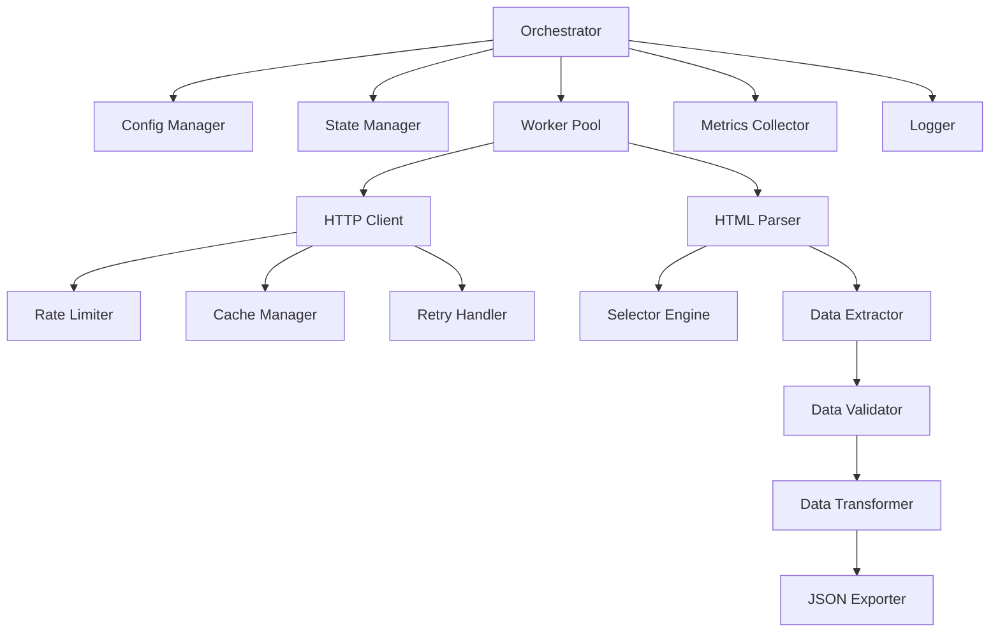

# Design Document - Scraper RobustCar Produção

## Overview

Sistema de scraping enterprise-grade para extração de dados de veículos do site RobustCar. Arquitetura modular, escalável e resiliente baseada em princípios de Engenharia de Dados.

## Architecture

### High-Level Architecture

```
┌─────────────────────────────────────────────────────────────┐
│                     Scraper Orchestrator                     │
│  (Coordena execução, gerencia workers, checkpoints)         │
└────────────┬────────────────────────────────────┬───────────┘
             │                                    │
    ┌────────▼────────┐                 ┌────────▼────────┐
    │  Config Manager │                 │  State Manager  │
    │  (YAML/Env)     │                 │  (SQLite)       │
    └─────────────────┘                 └─────────────────┘
             │                                    │
    ┌────────▼────────────────────────────────────▼───────────┐
    │              Worker Pool (3 workers)                     │
    │  ┌──────────┐  ┌──────────┐  ┌──────────┐             │
    │  │ Worker 1 │  │ Worker 2 │  │ Worker 3 │             │
    │  └────┬─────┘  └────┬─────┘  └────┬─────┘             │
    └───────┼─────────────┼─────────────┼────────────────────┘
            │             │             │
    ┌───────▼─────────────▼─────────────▼────────────────────┐
    │              HTTP Client Layer                          │
    │  (Rate Limiting, Retry Logic, Caching)                  │
    └────────┬────────────────────────────────────┬───────────┘
             │                                    │
    ┌────────▼────────┐                 ┌────────▼────────┐
    │  HTML Parser    │                 │  Data Validator │
    │  (BeautifulSoup)│                 │  (Pydantic)     │
    └────────┬────────┘                 └────────┬────────┘
             │                                    │
    ┌────────▼────────────────────────────────────▼───────────┐
    │              Data Pipeline                               │
    │  Extract → Transform → Validate → Load                   │
    └────────┬────────────────────────────────────┬───────────┘
             │                                    │
    ┌────────▼────────┐                 ┌────────▼────────┐
    │  JSON Exporter  │                 │  Metrics        │
    │  (Gzip)         │                 │  (Prometheus)   │
    └─────────────────┘                 └─────────────────┘
```

### Component Diagram



## Components and Interfaces

### 1. Orchestrator

**Responsabilidade**: Coordenação geral do scraping

**Interface**:
```python
class ScraperOrchestrator:
    def __init__(self, config: Config):
        """Inicializar com configuração"""
        
    def run(self, mode: str = "full") -> ScrapingResult:
        """
        Executar scraping
        
        Args:
            mode: "full" ou "incremental"
            
        Returns:
            ScrapingResult com estatísticas
        """
        
    def resume_from_checkpoint(self, checkpoint_id: str) -> ScrapingResult:
        """Retomar de checkpoint"""
        
    def get_status(self) -> Dict:
        """Status atual da execução"""
```

**Dependências**:
- ConfigManager
- StateManager
- WorkerPool
- MetricsCollector
- Logger

### 2. Config Manager

**Responsabilidade**: Gerenciamento de configurações

**Interface**:
```python
class ConfigManager:
    def load_config(self, path: str = "config.yaml") -> Config:
        """Carregar configuração de arquivo ou env vars"""
        
    def validate_config(self, config: Config) -> bool:
        """Validar configuração"""
        
    def get(self, key: str, default: Any = None) -> Any:
        """Obter valor de configuração"""
```

**Configurações**:
```yaml
scraper:
  name: "robustcar-scraper"
  version: "1.0.0"
  
http:
  timeout: 30
  max_retries: 3
  retry_backoff: 2.0
  user_agent: "FacilIAuto-Scraper/1.0 (contact@faciliauto.com)"
  
rate_limiting:
  requests_per_minute: 60
  delay_between_requests: 1.0
  respect_429: true
  business_hours_throttle: 0.5
  
workers:
  max_concurrent: 3
  queue_size: 100
  
cache:
  enabled: true
  ttl_hours: 24
  max_size_mb: 100
  
output:
  format: "json"
  compression: "gzip"
  schema_version: "1.0"
  
quality:
  min_completeness: 0.95
  fail_threshold: 0.10
  
logging:
  level: "INFO"
  format: "json"
  file: "logs/scraper.log"
  
metrics:
  enabled: true
  prometheus_port: 9090
```

### 3. State Manager

**Responsabilidade**: Gerenciar estado e histórico

**Interface**:
```python
class StateManager:
    def __init__(self, db_path: str = "state.db"):
        """Inicializar com SQLite"""
        
    def save_vehicle_hash(self, vehicle_id: str, content_hash: str):
        """Salvar hash de veículo"""
        
    def get_vehicle_hash(self, vehicle_id: str) -> Optional[str]:
        """Obter hash anterior"""
        
    def has_changed(self, vehicle_id: str, content_hash: str) -> bool:
        """Verificar se mudou"""
        
    def save_checkpoint(self, checkpoint: Checkpoint):
        """Salvar checkpoint"""
        
    def load_checkpoint(self, checkpoint_id: str) -> Optional[Checkpoint]:
        """Carregar checkpoint"""
```

**Schema SQLite**:
```sql
CREATE TABLE vehicles (
    id TEXT PRIMARY KEY,
    content_hash TEXT NOT NULL,
    last_seen TIMESTAMP NOT NULL,
    last_modified TIMESTAMP NOT NULL,
    status TEXT DEFAULT 'active'
);

CREATE TABLE checkpoints (
    id TEXT PRIMARY KEY,
    timestamp TIMESTAMP NOT NULL,
    processed_count INTEGER,
    success_count INTEGER,
    error_count INTEGER,
    last_vehicle_id TEXT,
    metadata JSON
);

CREATE TABLE scraping_runs (
    id TEXT PRIMARY KEY,
    start_time TIMESTAMP,
    end_time TIMESTAMP,
    mode TEXT,
    total_processed INTEGER,
    total_success INTEGER,
    total_errors INTEGER,
    metrics JSON
);
```

### 4. Worker Pool

**Responsabilidade**: Processamento paralelo

**Interface**:
```python
class WorkerPool:
    def __init__(self, num_workers: int = 3):
        """Inicializar pool de workers"""
        
    def submit(self, task: Task) -> Future:
        """Submeter tarefa"""
        
    def map(self, func: Callable, items: List) -> List[Result]:
        """Mapear função sobre itens"""
        
    def shutdown(self, wait: bool = True):
        """Encerrar workers"""
```

**Implementação**:
- ThreadPoolExecutor para I/O-bound tasks
- Queue para distribuição de trabalho
- Semaphore para controle de concorrência

### 5. HTTP Client Layer

**Responsabilidade**: Requisições HTTP com resiliência

**Interface**:
```python
class HTTPClient:
    def __init__(self, config: Config):
        """Inicializar com configuração"""
        
    def get(self, url: str, **kwargs) -> Response:
        """GET com retry e rate limiting"""
        
    def get_cached(self, url: str) -> Optional[Response]:
        """GET com cache"""
```

**Features**:
- Rate limiting com token bucket algorithm
- Exponential backoff retry
- Cache LRU com TTL
- Connection pooling
- Timeout configurável

### 6. HTML Parser

**Responsabilidade**: Parsing e extração de dados

**Interface**:
```python
class HTMLParser:
    def __init__(self, selector_config: Dict):
        """Inicializar com seletores"""
        
    def parse(self, html: str) -> BeautifulSoup:
        """Parse HTML"""
        
    def extract_field(self, soup: BeautifulSoup, field: str) -> Optional[str]:
        """Extrair campo com fallback de seletores"""
        
    def extract_vehicle(self, html: str) -> Dict:
        """Extrair todos os campos de um veículo"""
```

**Seletores com Fallback**:
```python
SELECTORS = {
    "nome": [
        "h1.car-title",
        "div.vehicle-name h1",
        "span.title-main"
    ],
    "preco": [
        "span.car-price",
        "div.price-value",
        "p.valor strong"
    ],
    "cambio": [
        "span.transmission",
        "div.specs .cambio",
        "li:contains('Câmbio') span"
    ],
    # ... outros campos
}
```

### 7. Data Validator

**Responsabilidade**: Validação de dados extraídos

**Interface**:
```python
class DataValidator:
    def validate(self, data: Dict) -> ValidationResult:
        """Validar dados completos"""
        
    def validate_field(self, field: str, value: Any) -> bool:
        """Validar campo específico"""
        
    def get_completeness(self, data: Dict) -> float:
        """Calcular completude (0.0 a 1.0)"""
```

**Regras de Validação**:
```python
VALIDATION_RULES = {
    "preco": {
        "type": float,
        "min": 10000,
        "max": 500000,
        "required": True
    },
    "ano": {
        "type": int,
        "min": 2010,
        "max": 2026,
        "required": True
    },
    "quilometragem": {
        "type": int,
        "min": 0,
        "max": 500000,
        "required": True
    },
    "cambio": {
        "type": str,
        "enum": ["Manual", "Automático", "Automático CVT", "Automatizada"],
        "required": True
    }
}
```

### 8. Data Transformer

**Responsabilidade**: Normalização e transformação

**Interface**:
```python
class DataTransformer:
    def transform(self, raw_data: Dict) -> Dict:
        """Transformar dados brutos"""
        
    def normalize_price(self, price_str: str) -> float:
        """Normalizar preço"""
        
    def normalize_km(self, km_str: str) -> int:
        """Normalizar quilometragem"""
        
    def normalize_cambio(self, cambio_str: str) -> str:
        """Normalizar câmbio"""
```

**Transformações**:
- Preço: "R$ 95.990,00" → 95990.0
- KM: "50.000 km" → 50000
- Câmbio: "Automático CVT" → "Automático CVT"
- Ano: "2022/2023" → 2023

### 9. JSON Exporter

**Responsabilidade**: Exportação de dados

**Interface**:
```python
class JSONExporter:
    def export(self, vehicles: List[Dict], output_path: str):
        """Exportar para JSON com compressão"""
        
    def validate_schema(self, data: Dict) -> bool:
        """Validar contra schema"""
```

**Formato de Saída**:
```json
{
  "metadata": {
    "schema_version": "1.0",
    "scraper_version": "1.0.0",
    "timestamp": "2025-10-30T14:30:00Z",
    "total_vehicles": 73,
    "source": "robustcar.com.br",
    "execution_time_seconds": 145.2
  },
  "vehicles": [
    {
      "id": "robust_1_0_1757696379",
      "nome": "Toyota Corolla GLi",
      "marca": "Toyota",
      "modelo": "Corolla",
      "ano": 2022,
      "preco": 95000.0,
      "quilometragem": 45000,
      "combustivel": "Flex",
      "cambio": "Automático CVT",
      "cor": "Prata",
      "portas": 4,
      "categoria": "Sedan",
      "imagens": ["url1", "url2"],
      "descricao": "...",
      "url_original": "...",
      "data_scraping": "2025-10-30T14:25:00Z",
      "content_hash": "abc123..."
    }
  ],
  "quality_metrics": {
    "completeness": 0.97,
    "total_extracted": 73,
    "total_validated": 71,
    "total_rejected": 2
  }
}
```

### 10. Metrics Collector

**Responsabilidade**: Coleta de métricas

**Interface**:
```python
class MetricsCollector:
    def increment(self, metric: str, value: int = 1):
        """Incrementar contador"""
        
    def gauge(self, metric: str, value: float):
        """Definir gauge"""
        
    def histogram(self, metric: str, value: float):
        """Registrar histograma"""
        
    def export_prometheus(self) -> str:
        """Exportar formato Prometheus"""
```

**Métricas**:
```python
# Contadores
scraper_vehicles_processed_total
scraper_vehicles_success_total
scraper_vehicles_error_total
scraper_http_requests_total
scraper_cache_hits_total
scraper_cache_misses_total

# Gauges
scraper_active_workers
scraper_queue_size
scraper_memory_usage_bytes

# Histogramas
scraper_request_duration_seconds
scraper_parse_duration_seconds
scraper_vehicle_processing_duration_seconds
```

## Data Models

### Vehicle Model

```python
from pydantic import BaseModel, Field, validator
from typing import List, Optional
from datetime import datetime

class Vehicle(BaseModel):
    """Modelo de veículo com validação"""
    
    id: str = Field(..., description="ID único do veículo")
    nome: str = Field(..., min_length=3, max_length=200)
    marca: str = Field(..., min_length=2, max_length=50)
    modelo: str = Field(..., min_length=2, max_length=100)
    ano: int = Field(..., ge=2010, le=2026)
    preco: float = Field(..., ge=10000, le=500000)
    quilometragem: int = Field(..., ge=0, le=500000)
    combustivel: str = Field(..., regex="^(Flex|Gasolina|Diesel|Elétrico|Híbrido)$")
    cambio: str = Field(..., regex="^(Manual|Automático|Automático CVT|Automatizada)$")
    cor: Optional[str] = Field(None, max_length=50)
    portas: Optional[int] = Field(None, ge=2, le=5)
    categoria: str = Field(..., regex="^(Hatch|Sedan|SUV|Pickup|Compacto|Van)$")
    imagens: List[str] = Field(default_factory=list)
    descricao: Optional[str] = Field(None, max_length=5000)
    url_original: str = Field(..., regex="^https?://")
    data_scraping: datetime = Field(default_factory=datetime.now)
    content_hash: str = Field(..., min_length=32, max_length=32)
    
    @validator('preco')
    def validate_price(cls, v):
        if v <= 0:
            raise ValueError('Preço deve ser positivo')
        return v
    
    @validator('quilometragem')
    def validate_km(cls, v, values):
        ano = values.get('ano')
        if ano and ano >= 2024 and v > 50000:
            raise ValueError('KM muito alta para carro novo')
        return v
```

## Error Handling

### Error Hierarchy

```python
class ScraperError(Exception):
    """Base exception"""
    pass

class NetworkError(ScraperError):
    """Erros de rede"""
    pass

class ParsingError(ScraperError):
    """Erros de parsing"""
    pass

class ValidationError(ScraperError):
    """Erros de validação"""
    pass

class ConfigurationError(ScraperError):
    """Erros de configuração"""
    pass
```

### Error Handling Strategy

1. **Network Errors**: Retry com exponential backoff
2. **Parsing Errors**: Log e continuar com próximo
3. **Validation Errors**: Salvar em rejected.json
4. **Configuration Errors**: Fail fast na inicialização

## Testing Strategy

### Unit Tests (80%+ coverage)

```python
# test_parser.py
def test_extract_price():
    parser = HTMLParser()
    html = '<span class="car-price">R$ 95.990,00</span>'
    assert parser.extract_price(html) == 95990.0

# test_validator.py
def test_validate_vehicle():
    validator = DataValidator()
    vehicle = {"preco": 95000, "ano": 2022, ...}
    result = validator.validate(vehicle)
    assert result.is_valid

# test_transformer.py
def test_normalize_cambio():
    transformer = DataTransformer()
    assert transformer.normalize_cambio("Automático CVT") == "Automático CVT"
```

### Integration Tests

```python
# test_integration.py
def test_full_scraping_flow():
    """Testar fluxo completo com HTML mockado"""
    scraper = ScraperOrchestrator(test_config)
    result = scraper.run(mode="full")
    assert result.success_count > 0
    assert result.error_rate < 0.05
```

### Smoke Tests

```python
# test_smoke.py
@pytest.mark.slow
def test_scrape_real_site():
    """Testar com site real (5 veículos)"""
    scraper = ScraperOrchestrator(prod_config)
    result = scraper.run_limited(max_vehicles=5)
    assert result.success_count >= 4
```

## Performance Considerations

### Optimization Strategies

1. **Connection Pooling**: Reusar conexões HTTP
2. **Parallel Processing**: 3 workers concorrentes
3. **Caching**: Cache de páginas com TTL 24h
4. **Incremental Loading**: Apenas mudanças
5. **Lazy Parsing**: Parse apenas campos necessários

### Performance Targets

- **Throughput**: 10+ veículos/minuto
- **Memory**: < 500MB RAM
- **CPU**: < 50% de 1 core
- **Network**: < 1MB/s bandwidth

## Deployment

### Requirements

```
Python 3.10+
requests==2.31.0
beautifulsoup4==4.12.2
pydantic==2.5.0
pyyaml==6.0.1
prometheus-client==0.19.0
```

### Execution

```bash
# Instalação
pip install -r requirements.txt

# Execução full
python scraper.py --mode full

# Execução incremental
python scraper.py --mode incremental

# Retomar de checkpoint
python scraper.py --resume checkpoint_123

# Com configuração customizada
python scraper.py --config custom_config.yaml
```

---

**Data**: 30/10/2025  
**Versão**: 1.0  
**Status**: Aprovação Pendente
