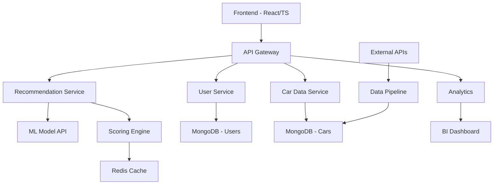

# 🤖 Colaboração dos Agentes - CarMatch

## 🎯 Orchestração dos Agentes Especializados

Este documento define como cada agente contribui para o desenvolvimento do CarMatch, incluindo responsabilidades específicas, entregáveis e pontos de colaboração.

---

## 1. 📊 Data Analyst - Engine de Inteligência

### **Responsabilidades Principais**
- Desenvolver algoritmo de recomendação
- Analisar dados de mercado automotivo
- Criar modelos de scoring ponderado
- Implementar sistema de aprendizado contínuo

### **Entregáveis**
1. **Database Schema** completo dos carros
2. **Algoritmo de Recomendação** com pesos dinâmicos
3. **APIs de Scoring** para diferentes perfis
4. **Dashboard Analytics** para monitoramento
5. **Modelo de ML** para personalização

### **Dados a Coletar**
```javascript
// Fonte: FIPE, Webmotors, OLX, fabricantes
car_data = {
  // Dados básicos
  marca, modelo, versao, ano, preco_fipe,
  
  // Especificações técnicas
  consumo_cidade, consumo_estrada, potencia, torque,
  tipo_combustivel, cambio, tracao,
  
  // Dimensões e espaço
  porta_malas, numero_lugares, comprimento, largura,
  
  // Confiabilidade (JD Power, CESVI)
  nota_confiabilidade, custo_manutencao, frequencia_defeitos,
  
  // Mercado
  depreciacao_1ano, depreciacao_3anos, volume_vendas,
  liquidez_revenda, tempo_medio_venda,
  
  // Disponibilidade
  regioes_disponiveis, rede_concessionarias, estoque_medio
}
```

### **Algoritmo de Scoring**
```python
def calculate_car_score(car, user_criteria, weights):
    scores = {
        'preco': score_price_fit(car.preco, user_criteria.budget),
        'consumo': score_fuel_efficiency(car.consumo, weights.consumo),
        'espaco': score_space_adequacy(car.dimensoes, user_criteria.familia),
        'confiabilidade': score_reliability(car.confiabilidade),
        'performance': score_performance(car.potencia, weights.performance),
        'revenda': score_resale_value(car.depreciacao),
        'disponibilidade': score_availability(car.estoque, user_criteria.regiao)
    }
    
    # Aplicar pesos por perfil
    weighted_score = sum(scores[k] * weights[k] for k in scores)
    
    # Bonus por preferência de marca
    if car.marca in user_criteria.marcas_preferidas:
        weighted_score *= 1.15
    
    # Penalty por rejeição
    if car.marca in user_criteria.marcas_rejeitadas:
        weighted_score *= 0.5
    
    return weighted_score
```

---

## 2. 🎨 Product Manager - Experiência & Estratégia

### **Responsabilidades Principais**
- Definir product vision e roadmap
- Mapear jornada completa do usuário
- Priorizar features baseado em valor
- Estabelecer métricas de sucesso

### **Entregáveis**
1. **Product Requirements Document (PRD)**
2. **User Journey Map** detalhado
3. **Feature Prioritization Matrix** (RICE)
4. **OKRs e KPIs** do produto
5. **Go-to-Market Strategy**

### **Jornada do Usuário Detalhada**

#### **Descoberta** (Awareness)
- Como o usuário descobre nossa solução?
- Pontos de dor atuais na busca por carros
- Canais de aquisição prioritários

#### **Consideração** (Consideration)
- Por que escolher CarMatch vs concorrentes?
- Proposta de valor única
- Proof points e validação social

#### **Conversão** (Decision)
- Processo de questionário otimizado
- Redução de fricção
- Call-to-actions efetivos

#### **Retenção** (Loyalty)
- Refinamento contínuo das recomendações
- Alertas de oportunidades de mercado
- Community e reviews

### **Feature Prioritization (RICE)**

| Feature | Reach | Impact | Confidence | Effort | RICE Score |
|---------|-------|--------|------------|--------|------------|
| Questionário Básico | 1000 | 3 | 95% | 5 | 570 |
| Engine Recomendação | 1000 | 3 | 90% | 8 | 338 |
| Comparação Carros | 800 | 2 | 85% | 3 | 453 |
| Simulador Financiamento | 600 | 3 | 70% | 6 | 210 |
| Reviews Usuários | 400 | 2 | 60% | 4 | 120 |

### **OKRs Q1 2024**

**Objetivo**: Lançar MVP com alta satisfação de usuário

**Key Results**:
- KR1: 1.000 usuários completam questionário (baseline: 0)
- KR2: NPS > 70 nas recomendações
- KR3: 15% dos usuários agendam test drive
- KR4: Tempo médio de sessão > 8 minutos

---

## 3. 💻 Tech Lead - Arquitetura & Desenvolvimento

### **Responsabilidades Principais**
- Definir arquitetura técnica scalável
- Liderar desenvolvimento backend/frontend
- Implementar CI/CD e DevOps
- Garantir performance e segurança

### **Entregáveis**
1. **System Architecture Design**
2. **API Documentation** completa
3. **Database Design** otimizado
4. **Performance Benchmarks**
5. **Security & Privacy Implementation**

### **Arquitetura do Sistema**



### **Tech Stack**

#### **Frontend**
```javascript
// React + TypeScript + Vite
{
  "framework": "React 18",
  "language": "TypeScript",
  "bundler": "Vite",
  "styling": "Styled Components + Chakra UI",
  "state": "Zustand",
  "routing": "React Router v6",
  "testing": "Vitest + React Testing Library"
}
```

#### **Backend**
```javascript
// Node.js + Express + MongoDB
{
  "runtime": "Node.js 18",
  "framework": "Express.js",
  "database": "MongoDB Atlas",
  "cache": "Redis",
  "auth": "JWT + bcrypt",
  "validation": "Joi",
  "testing": "Jest + Supertest",
  "docs": "Swagger/OpenAPI"
}
```

#### **Infrastructure**
```yaml
# Docker + AWS/Vercel
containers:
  - frontend: Vercel deployment
  - backend: AWS ECS Fargate
  - database: MongoDB Atlas
  - cache: AWS ElastiCache
  - cdn: CloudFront
  - monitoring: AWS CloudWatch + Datadog
```

### **API Endpoints**

```javascript
// Core APIs
POST /api/v1/questionnaire/submit
GET  /api/v1/recommendations/:sessionId
GET  /api/v1/cars/:carId/details
POST /api/v1/cars/compare
GET  /api/v1/financing/simulate

// Admin APIs
GET  /api/v1/admin/analytics
POST /api/v1/admin/cars/import
PUT  /api/v1/admin/algorithm/weights
```

---

## 4. ✍️ Content Creator - Interface & Conteúdo

### **Responsabilidades Principais**
- Criar interface intuitiva e responsiva
- Desenvolver copywriting persuasivo
- Produzir conteúdo educativo
- Otimizar UX/UI continuamente

### **Entregáveis**
1. **Design System** completo
2. **Wireframes & Protótipos** interativos
3. **Copywriting** para toda aplicação
4. **Conteúdo Educativo** sobre carros
5. **Landing Pages** otimizadas

### **Design System**

#### **Cores**
```css
:root {
  /* Primary */
  --car-blue: #1e40af;      /* Confiança, tecnologia */
  --car-blue-light: #3b82f6;
  --car-blue-dark: #1e3a8a;
  
  /* Secondary */
  --car-orange: #ea580c;    /* Energia, ação */
  --car-orange-light: #fb923c;
  
  /* Neutrals */
  --gray-50: #f9fafb;
  --gray-900: #111827;
  
  /* Status */
  --success: #10b981;       /* Economia, eco */
  --warning: #f59e0b;       /* Atenção */
  --error: #ef4444;         /* Problemas */
}
```

#### **Typography**
```css
/* Headings */
h1 { font: 700 2.5rem/1.2 'Inter', sans-serif; }
h2 { font: 600 2rem/1.3 'Inter', sans-serif; }
h3 { font: 600 1.5rem/1.4 'Inter', sans-serif; }

/* Body */
body { font: 400 1rem/1.6 'Inter', sans-serif; }
.small { font: 400 0.875rem/1.5 'Inter', sans-serif; }
```

### **Questionnaire UX Flow**

#### **Passo 1: Orçamento & Localização**
```jsx
<OrçamentoStep>
  <h2>Qual seu orçamento para o carro?</h2>
  <RangeSlider 
    min={20000} 
    max={200000}
    formatLabel={formatCurrency}
    tooltip="Incluindo financiamento e entrada"
  />
  
  <LocationSelect 
    placeholder="Em qual cidade você está?"
    autocomplete={true}
  />
</OrçamentoStep>
```

#### **Passo 2: Perfil de Uso**
```jsx
<UsoStep>
  <h2>Como você vai usar o carro?</h2>
  <CardOptions>
    <OptionCard value="trabalho">
      <Icon name="briefcase" />
      <h3>Trabalho diário</h3>
      <p>Cidade, trânsito, economia</p>
    </OptionCard>
    
    <OptionCard value="familia">
      <Icon name="family" />
      <h3>Família</h3>
      <p>Espaço, segurança, conforto</p>
    </OptionCard>
    
    <OptionCard value="lazer">
      <Icon name="map" />
      <h3>Viagens e lazer</h3>
      <p>Estrada, performance, bagagem</p>
    </OptionCard>
  </CardOptions>
</UsoStep>
```

### **Copywriting Strategy**

#### **Headlines Persuasivos**
- "Encontre o carro perfeito em 5 minutos" (Benefício + Tempo)
- "Recomendações personalizadas com IA" (Tecnologia + Personalização)
- "Compare 1.000+ carros automaticamente" (Escala + Conveniência)

#### **Microcopy Orientativo**
```javascript
const microcopy = {
  loading: "Analisando 1.247 carros disponíveis...",
  tooltip_consumo: "Economia de combustível na cidade e estrada",
  help_budget: "Inclua entrada, financiamento e seguro",
  empty_state: "Ajuste os filtros para encontrar mais opções",
  error_gentle: "Ops! Algo deu errado. Vamos tentar novamente?"
}
```

---

## 5. 🚀 Marketing Strategist - Growth & Conversão

### **Responsabilidades Principais**
- Desenvolver estratégia go-to-market
- Otimizar conversão e retenção
- Criar campaigns de aquisição
- Estabelecer parcerias estratégicas

### **Entregáveis**
1. **Go-to-Market Plan** completo
2. **Customer Acquisition Strategy**
3. **Content Marketing Calendar**
4. **Partnership Strategy** com concessionárias
5. **Growth Experiments** roadmap

### **Customer Acquisition Strategy**

#### **Canal 1: SEO Content Marketing**
```markdown
# Estratégia de Conteúdo SEO

## Palavras-chave Primárias
- "melhor carro para família" (2.4k/mês)
- "carro econômico 2024" (1.8k/mês)
- "qual carro comprar" (3.2k/mês)
- "comparar carros preço" (1.5k/mês)

## Calendário Editorial
### Semana 1-2: Guias Comparativos
- "Top 10 carros mais econômicos 2024"
- "SUV vs Sedan: Qual escolher para sua família?"
- "Carros com melhor custo-benefício até R$ 50k"

### Semana 3-4: Conteúdo Educativo
- "Como calcular o real custo de um carro"
- "Financiamento vs Consórcio vs À vista"
- "Checklist para comprar carro usado"
```

#### **Canal 2: Paid Social**
```javascript
const campaigns = {
  facebook: {
    audiences: [
      "Homens e mulheres, 25-45 anos",
      "Interessados em: carros, financiamento",
      "Comportamentos: compradores de carro",
      "Lookalikes: usuários atuais"
    ],
    creatives: [
      "Vídeo: Processo de recomendação",
      "Carrossel: Diferentes perfis de usuário", 
      "Static: Testimonials de usuários"
    ]
  }
}
```

#### **Canal 3: Partnerships**
```markdown
# Parcerias Estratégicas

## Concessionárias (Revenue Share)
- Lead qualificado = R$ 50
- Test drive agendado = R$ 100
- Venda concluída = R$ 500

## Influenciadores Automotivos
- Reviews do CarMatch
- Conteúdo educativo compartilhado
- Live de recomendações

## Apps Complementares
- Financiadoras (integração API)
- Seguradoras (cotação automática)
- Inspeção veicular (agendamento)
```

### **Conversion Optimization**

#### **Landing Page A/B Tests**
```javascript
const experiments = [
  {
    test: "Hero headline",
    variants: [
      "Encontre o carro ideal em 5 minutos",
      "IA que encontra o carro perfeito para você", 
      "Compare 1000+ carros e escolha o melhor"
    ],
    metric: "Questionnaire start rate",
    duration: "2 weeks"
  },
  {
    test: "CTA button",
    variants: [
      "Começar agora - Grátis",
      "Encontrar meu carro",
      "Ver recomendações"
    ],
    metric: "Click-through rate",
    duration: "1 week"
  }
]
```

---

## 6. 📋 Business Analyst - Requisitos & Compliance

### **Responsabilidades Principais**
- Documentar requisitos funcionais/não-funcionais
- Mapear processos de negócio
- Garantir compliance e regulamentações
- Análise de viabilidade comercial

### **Entregáveis**
1. **Business Requirements Document (BRD)**
2. **Functional Specifications** detalhadas
3. **Compliance Assessment** (LGPD, PROCON)
4. **Business Case** com ROI projetado
5. **Risk Assessment & Mitigation**

### **Functional Requirements**

#### **FR-001: Sistema de Questionário**
```markdown
**Descrição**: O sistema deve capturar preferências do usuário através de questionário intuitivo

**Critérios de Aceitação**:
- ✅ Usuário pode navegar entre passos (anterior/próximo)
- ✅ Progresso é salvo automaticamente
- ✅ Validação em tempo real dos campos
- ✅ Mobile responsive (até 320px)
- ✅ Tempo máximo de carregamento: 2s
- ✅ Acessibilidade WCAG 2.1 AA
```

#### **FR-002: Engine de Recomendação**
```markdown
**Descrição**: Sistema deve gerar recomendações personalizadas baseadas no perfil

**Critérios de Aceitação**:
- ✅ Processa até 10.000 carros em <3s
- ✅ Retorna top 10 recomendações rankeadas
- ✅ Justificativa personalizada por recomendação
- ✅ Accuracy > 85% vs feedback usuário
- ✅ Fallback para critérios não atendidos
```

### **Non-Functional Requirements**

#### **Performance**
- Response time: < 2s (95th percentile)
- Throughput: 1000 concurrent users
- Availability: 99.9% uptime
- Scalability: Auto-scaling até 10k users

#### **Security**
- HTTPS obrigatório
- Rate limiting: 100 req/min por IP
- Input validation e sanitization
- Logs de auditoria
- Backup diário automatizado

### **LGPD Compliance Assessment**

#### **Dados Coletados**
```javascript
const personal_data = {
  // Mínimos necessários
  location: "Cidade do usuário",
  preferences: "Critérios de busca",
  session: "Dados de navegação",
  
  // Opcionais
  email: "Para salvar resultados",
  phone: "Para contato de vendedores"
}
```

#### **Base Legal**
- **Legítimo Interesse**: Recomendações personalizadas
- **Consentimento**: Email marketing e contato
- **Execução de Contrato**: Agendamento test drive

#### **Direitos do Titular**
- ✅ Acesso aos dados
- ✅ Correção de dados
- ✅ Exclusão (direito ao esquecimento)
- ✅ Portabilidade
- ✅ Revogação de consentimento

### **Business Case & ROI**

#### **Investment Required**
```markdown
# Investimento Inicial (6 meses)
- Desenvolvimento: R$ 150.000
- Infraestrutura: R$ 12.000 
- Marketing: R$ 50.000
- Equipe: R$ 180.000
**Total: R$ 392.000**
```

#### **Revenue Projections**
```markdown
# Receita Projetada (Ano 1)
- Leads para concessionárias: R$ 240.000 (4.800 leads × R$ 50)
- Test drives agendados: R$ 120.000 (1.200 × R$ 100)  
- Vendas concluídas: R$ 150.000 (300 × R$ 500)
- Partnerships premium: R$ 60.000
**Total: R$ 570.000**

**ROI Ano 1: 45%**
**Payback: 8 meses**
```

---

## 🔄 Processo de Colaboração

### **Sprint Planning (Bi-weekly)**
1. **Product Manager** define prioridades
2. **Tech Lead** quebra em tarefas técnicas  
3. **Data Analyst** especifica requirements de dados
4. **Content Creator** alinha designs e copy
5. **Marketing Strategist** planeja campaigns
6. **Business Analyst** valida compliance

### **Daily Sync (15min)**
- Progresso individual
- Blockers identificados
- Dependências entre agentes
- Próximos steps

### **Sprint Review (2h)**
- Demo das funcionalidades
- Feedback dos stakeholders
- Métricas de performance
- Ajustes no roadmap

### **Retrospective (1h)**
- O que funcionou bem
- Pontos de melhoria
- Ações para próximo sprint
- Process optimization

---

## 📊 Success Metrics por Agente

### **Data Analyst**
- Accuracy do algoritmo: >85%
- Performance da API: <2s response time
- Cobertura da base de dados: >1000 carros
- User satisfaction com recomendações: >4.5/5

### **Product Manager** 
- Product-market fit score: >40%
- Feature adoption rate: >60%
- User retention D7: >40%
- NPS: >70

### **Tech Lead**
- System uptime: >99.9%
- Code coverage: >80%
- Security score: >90%
- Performance budget: <100kb initial load

### **Content Creator**
- Conversion rate landing: >5%
- Questionnaire completion: >80%
- Mobile usability score: >95
- Accessibility score: >90

### **Marketing Strategist**
- CAC: <R$ 25
- LTV:CAC ratio: >3:1
- Organic traffic growth: >20%/mês
- Conversion rate: >2%

### **Business Analyst**
- Requirements stability: <10% changes
- Compliance score: 100%
- Stakeholder satisfaction: >4.5/5
- Project delivery: on-time & budget
