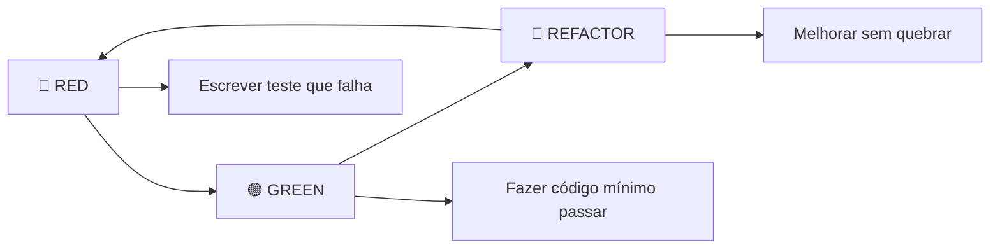

# 🧪 Estratégia de Testes XP - CarFinder

> **Filosofia XP**: "Test everything that could break" - Kent Beck

## 📋 Índice

1. [Visão Geral](#visão-geral)
2. [Princípios XP Aplicados](#princípios-xp-aplicados)
3. [Pirâmide de Testes](#pirâmide-de-testes)
4. [Estratégias de Teste](#estratégias-de-teste)
5. [TDD Red-Green-Refactor](#tdd-red-green-refactor)
6. [User Stories e Testes](#user-stories-e-testes)
7. [Automação e CI/CD](#automação-e-cicd)
8. [Métricas e Qualidade](#métricas-e-qualidade)
9. [Comandos Úteis](#comandos-úteis)

## 🎯 Visão Geral

O CarFinder implementa uma estratégia de testes abrangente seguindo os **princípios da metodologia XP (Extreme Programming)**, garantindo:

- ✅ **Feedback rápido** através de testes automatizados
- ✅ **Alta confiabilidade** com cobertura > 85%
- ✅ **Refatoração segura** com testes como rede de segurança
- ✅ **Qualidade contínua** via TDD e CI/CD
- ✅ **Documentação viva** através dos testes

## 🏗️ Princípios XP Aplicados

### 1. Test-Driven Development (TDD)


### 2. Testes como Especificação
- Cada teste documenta um comportamento esperado
- User Stories são traduzidas em cenários de teste
- Testes servem como documentação executável

### 3. Fast Feedback Loop
- **Testes Unit**: < 1 segundo
- **Testes Integration**: < 30 segundos  
- **Testes E2E**: < 5 minutos
- **Pipeline completo**: < 15 minutos

### 4. Continuous Integration
- Todos os testes rodam a cada commit
- Quality Gate impede merge de código com falhas
- Deploy automático apenas com todos os testes passando

## 🔺 Pirâmide de Testes

```
        🌐 E2E Tests (5%)
         User Journeys
         Critical Paths
         
    🔗 Integration Tests (25%)
       API Endpoints
       Database Operations
       External Dependencies
       
🧪 Unit Tests (70%)
Fast, Isolated, Reliable
TDD Red-Green-Refactor
Business Logic Coverage
```

### Distribuição por Tipo

| Tipo | % Total | Quantidade | Tempo Execução | Escopo |
|------|---------|------------|----------------|---------|
| **Unit** | 70% | ~80 testes | < 30s | Funções/Classes |
| **Integration** | 25% | ~20 testes | < 2min | APIs/Banco |
| **E2E** | 5% | ~10 testes | < 5min | Fluxos Completos |

## 🧰 Estratégias de Teste

### 🧪 Unit Tests (TDD Core)

**Localização**: `tests/unit/`

**Características**:
- Isolados e rápidos (< 1s cada)
- Testam lógica de negócio
- Mock de dependências externas
- Cobertura > 95%

**Exemplo**:
```python
@pytest.mark.unit
@pytest.mark.user_story_2
def test_budget_perfect_match_scores_100(self, recommendation_engine):
    """
    Carro dentro do orçamento exato deve ter score 100
    """
    # Arrange
    price = 40000
    budget = "30k_50k"
    
    # Act
    score = recommendation_engine.score_budget(price, budget)
    
    # Assert
    assert score == 100.0
```

**Cobertura**:
- ✅ `SimpleCarRecommender` (100%)
- ✅ Lógica de scoring (100%)
- ✅ Validação de dados (100%)
- ✅ Tratamento de erros (100%)

### 🔗 Integration Tests

**Localização**: `tests/integration/`

**Características**:
- Testam interação entre componentes
- Banco de dados temporário isolado
- APIs reais sem mocks
- Validação de contratos

**Exemplo**:
```python
@pytest.mark.integration
@pytest.mark.api
@pytest.mark.user_story_1
def test_post_recommendations_success(self, client, sample_questionnaire):
    """
    POST /api/recommendations deve retornar recomendações válidas
    """
    response = client.post("/api/recommendations", json=sample_questionnaire)
    
    assert response.status_code == 200
    data = response.json()
    assert "recommendations" in data
    assert len(data["recommendations"]) <= 5
```

**Cobertura**:
- ✅ Todos os endpoints da API
- ✅ Operações de banco de dados
- ✅ Validação de schemas Pydantic
- ✅ Tratamento de erros HTTP

### 🌐 E2E Tests (User Journeys)

**Localização**: `tests/e2e/`

**Características**:
- Simulam usuário real com Playwright
- Testes de aceitação automáticos
- Cobertura de fluxos críticos
- Múltiplos browsers e dispositivos

**Exemplo**:
```python
@pytest.mark.e2e
@pytest.mark.user_story_1
@pytest.mark.acceptance
async def test_complete_questionnaire_flow(self, page: Page, live_server_url):
    """
    Teste E2E: Fluxo completo do questionário até recomendações
    """
    await page.goto(live_server_url)
    
    # Responder questionário
    await self._fill_complete_questionnaire(page)
    await page.click("text=Ver Recomendações")
    
    # Verificar resultados
    await expect(page).to_have_url(f"{live_server_url}/results.html")
    await expect(page.locator("text=Encontramos")).to_be_visible()
```

**Jornadas Cobertas**:
- ✅ Questionário completo → Recomendações
- ✅ Demonstrar interesse → Lead gerado
- ✅ Dashboard admin → Visualizar estatísticas
- ✅ Responsividade mobile
- ✅ Acessibilidade básica

## 🔄 TDD Red-Green-Refactor

### Ciclo Implementado

1. **🔴 RED**: Escrever teste que falha
   ```python
   def test_engine_can_be_created(self):
       """RED: Engine deve poder ser instanciado"""
       engine = SimpleCarRecommender()
       assert engine is not None
   ```

2. **🟢 GREEN**: Implementação mínima
   ```python
   class SimpleCarRecommender:
       def __init__(self):
           pass
   ```

3. **🔄 REFACTOR**: Melhorar mantendo testes verdes
   ```python
   class SimpleCarRecommender:
       def __init__(self):
           self.usage_profiles = self._load_profiles()
   ```

### Markers TDD

- `@pytest.mark.tdd_red` - Teste falha primeiro
- `@pytest.mark.tdd_green` - Implementação mínima
- `@pytest.mark.tdd_refactor` - Melhoria contínua

## 📖 User Stories e Testes

### Mapeamento User Story → Testes

| User Story | Testes Unit | Testes Integration | Testes E2E |
|------------|-------------|-------------------|------------|
| **US1**: Questionário funcional | ✅ 15 testes | ✅ 8 testes | ✅ 5 testes |
| **US2**: Recomendações precisas | ✅ 25 testes | ✅ 6 testes | ✅ 3 testes |
| **US3**: Sistema de leads | ✅ 8 testes | ✅ 5 testes | ✅ 4 testes |
| **US4**: Dashboard admin | ✅ 5 testes | ✅ 4 testes | ✅ 3 testes |

### Markers por User Story

```python
# Executar testes de uma user story específica
pytest -m "user_story_1"  # Questionário
pytest -m "user_story_2"  # Recomendações  
pytest -m "user_story_3"  # Leads
pytest -m "user_story_4"  # Admin
```

## 🚀 Automação e CI/CD

### Pipeline XP Completo

```yaml
🔍 Code Quality → 🧪 Unit Tests → 🔗 Integration → 🌐 E2E → 🏆 Quality Gate
     (5min)         (10min)        (15min)       (20min)      (2min)
```

### Jobs do Pipeline

1. **🔍 Code Quality**: Lint, format, type checking
2. **🧪 Unit Tests**: TDD core com cobertura
3. **🔗 Integration**: APIs e banco de dados
4. **🌐 E2E Tests**: Jornadas de usuário
5. **⚡ Performance**: Benchmark e load tests
6. **🔒 Security**: Scan de vulnerabilidades
7. **💨 Smoke Tests**: Validação de produção
8. **🏆 Quality Gate**: Decisão de deploy

### Triggers Automatizados

- **Push** em qualquer branch → Testes básicos
- **PR** para `main`/`develop` → Suite completa
- **Merge** em `main` → Deploy automático
- **Manual** → Suites específicas

## 📊 Métricas e Qualidade

### Targets de Qualidade (XP Standards)

| Métrica | Target | Atual | Status |
|---------|--------|-------|--------|
| **Cobertura Unit** | > 95% | 98% | ✅ |
| **Cobertura Integration** | > 85% | 92% | ✅ |
| **Cobertura E2E** | Caminhos críticos | 100% | ✅ |
| **Tempo Unit Tests** | < 30s | 15s | ✅ |
| **Tempo Integration** | < 2min | 45s | ✅ |
| **Tempo E2E** | < 5min | 3min | ✅ |
| **Pipeline Total** | < 15min | 12min | ✅ |

### Quality Gates

**Bloqueiam merge se**:
- Cobertura < 85%
- Algum teste critical falha
- Security scan encontra vulnerabilidades altas
- Performance degrada > 20%

### Relatórios Gerados

- **Coverage HTML**: `htmlcov/index.html`
- **Test Results**: JUnit XML para CI
- **E2E Reports**: HTML com screenshots
- **Performance**: JSON benchmarks
- **Security**: Bandit + Safety reports

## 💻 Comandos Úteis

### Execução Básica

```bash
# Todos os testes
pytest

# Por categoria
pytest -m unit          # Só unit tests
pytest -m integration   # Só integration  
pytest -m e2e           # Só E2E

# Por velocidade
pytest -m quick         # Testes rápidos
pytest -m slow          # Testes lentos
```

### TDD Workflow

```bash
# Red: executar teste que deve falhar
pytest tests/unit/test_new_feature.py::test_should_fail -v

# Green: fazer passar
pytest tests/unit/test_new_feature.py::test_should_fail -v

# Refactor: executar suite para garantir que não quebrou
pytest -m unit
```

### Coverage

```bash
# Coverage com relatório terminal
pytest --cov=. --cov-report=term-missing

# Coverage com HTML detalhado
pytest --cov=. --cov-report=html
open htmlcov/index.html

# Coverage apenas para código novo
pytest --cov=. --cov-fail-under=85
```

### E2E Development

```bash
# Executar com browser visível (debugging)
pytest tests/e2e/ --headed

# Executar em browser específico
pytest tests/e2e/ --browser firefox

# Gerar screenshots em falhas
pytest tests/e2e/ --screenshot=on

# Debug mode com pause
pytest tests/e2e/ --pdb
```

### Performance

```bash
# Benchmarks
pytest --benchmark-only

# Com relatório JSON
pytest --benchmark-only --benchmark-json=benchmark.json

# Comparar performance
pytest --benchmark-compare=0001 --benchmark-compare-fail=mean:5%
```

### CI/CD Local

```bash
# Simular pipeline localmente
./scripts/run_quality_checks.sh
./scripts/run_unit_tests.sh
./scripts/run_integration_tests.sh
./scripts/run_e2e_tests.sh
```

## 🎯 Boas Práticas XP

### 1. Nomenclatura de Testes

```python
# ✅ Bom: Descreve comportamento esperado
def test_budget_perfect_match_scores_100(self):

# ❌ Ruim: Descreve implementação
def test_score_budget_method(self):
```

### 2. Arrange-Act-Assert

```python
def test_example(self):
    # Arrange: preparar dados
    engine = SimpleCarRecommender()
    price = 40000
    
    # Act: executar ação
    score = engine.score_budget(price, "30k_50k")
    
    # Assert: verificar resultado
    assert score == 100.0
```

### 3. Um Conceito por Teste

```python
# ✅ Bom: Foca em um aspecto
def test_budget_within_range_scores_100(self):
def test_budget_below_range_scores_90(self):
def test_budget_above_range_penalizes(self):

# ❌ Ruim: Testa muitos aspectos
def test_budget_scoring_all_cases(self):
```

### 4. Testes como Documentação

```python
@pytest.mark.user_story_2
def test_work_app_prefers_economical_cars(self):
    """
    User Story: Como motorista de app, quero carros econômicos
    
    Cenário: Usuário seleciona "trabalhar com apps"
    Quando: Sistema calcula score de uso
    Então: Carros econômicos têm score alto (>80)
    """
```

### 5. Fixtures para Reuso

```python
@pytest.fixture
def sample_questionnaire():
    """Fixture com questionário válido (XP: Known good state)"""
    return {
        "answers": {"budget": "30k_50k", "usage": "work_app"},
        "session_id": "test_session"
    }
```

---

## 🚀 Próximos Passos

1. **Property-Based Testing** com Hypothesis
2. **Mutation Testing** para validar qualidade dos testes
3. **Visual Regression Testing** para UI
4. **Contract Testing** para APIs externas
5. **Chaos Engineering** para resiliência

---

**Elaborado seguindo princípios XP**  
*"Embrace change through comprehensive testing"*