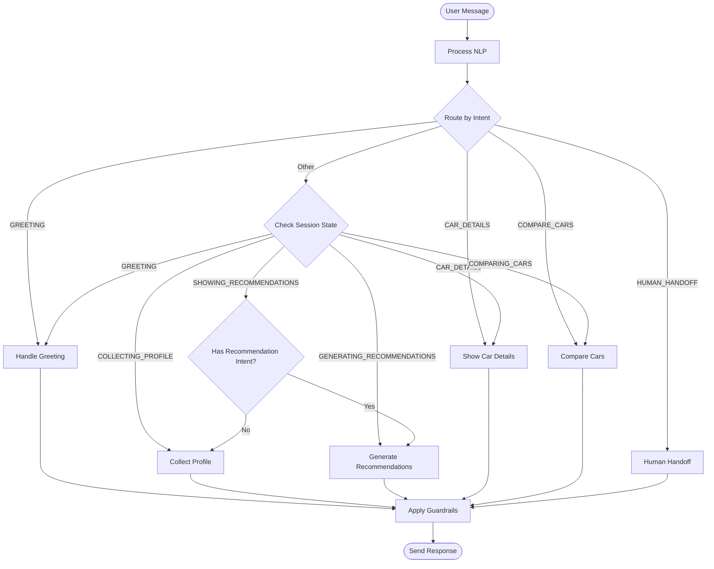
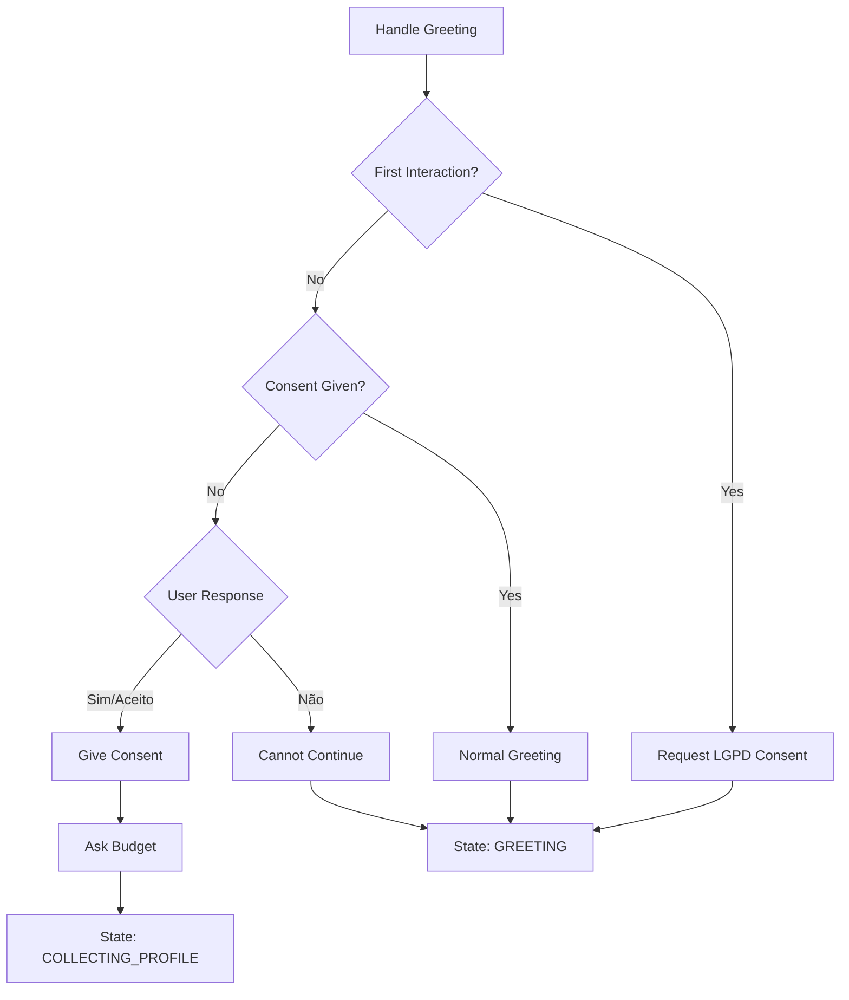
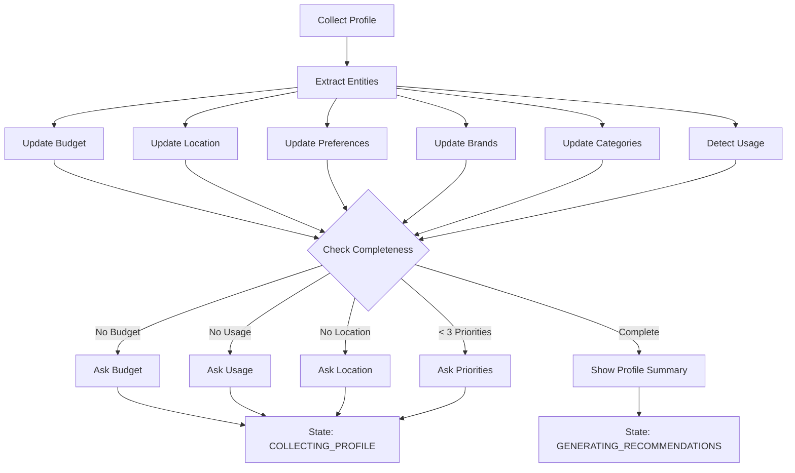
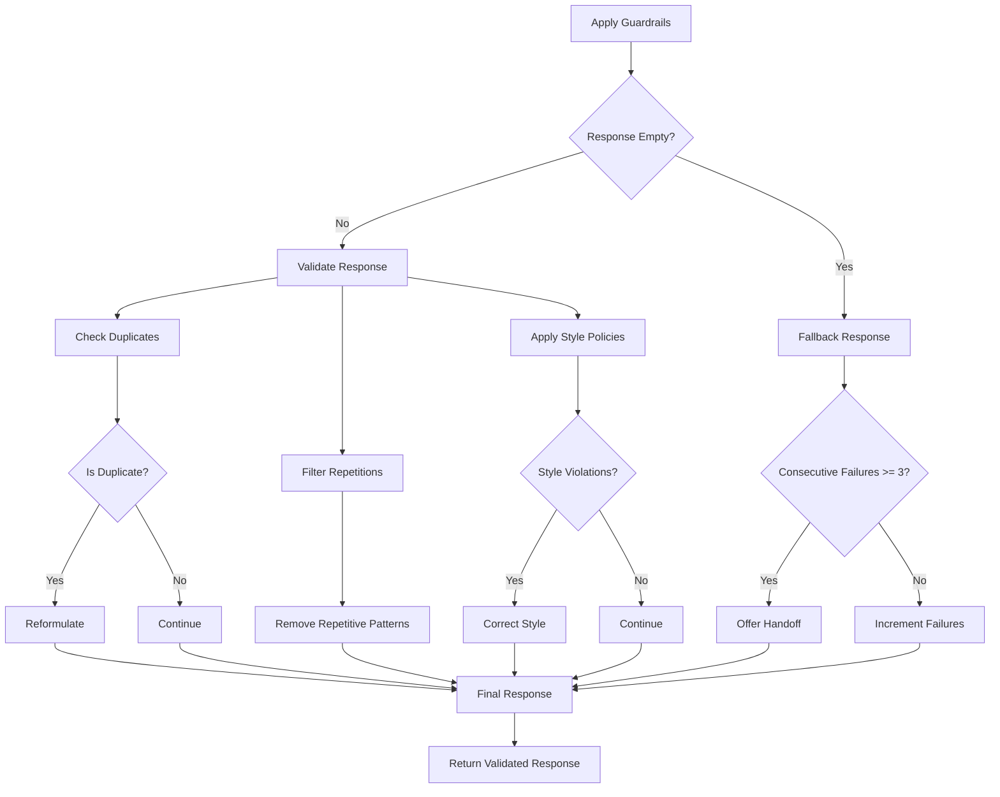
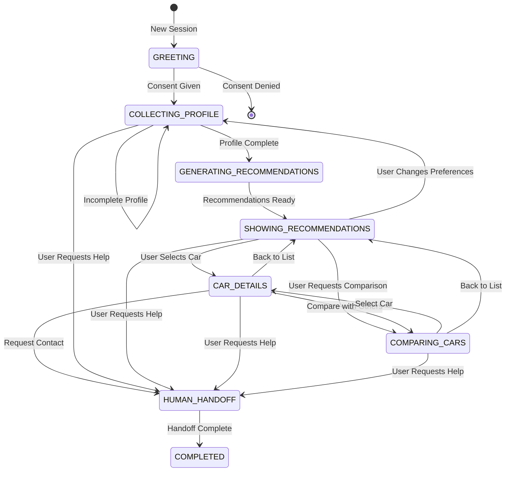
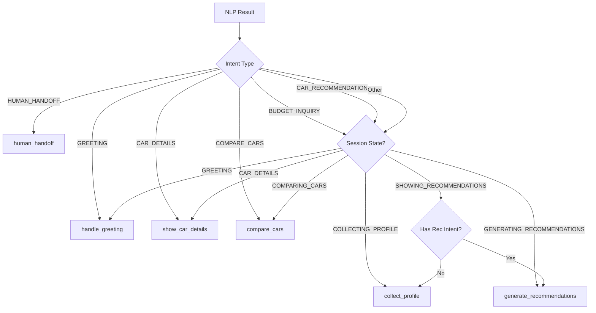
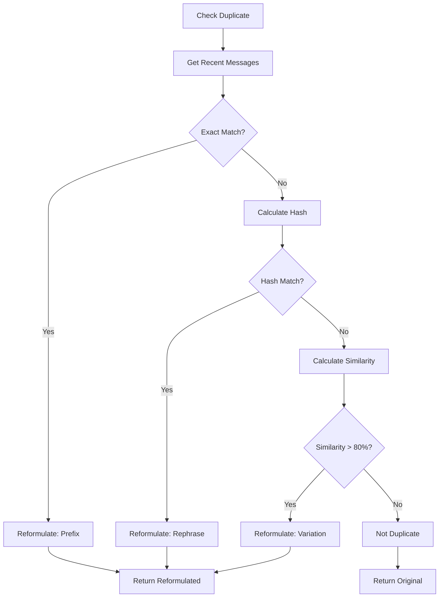
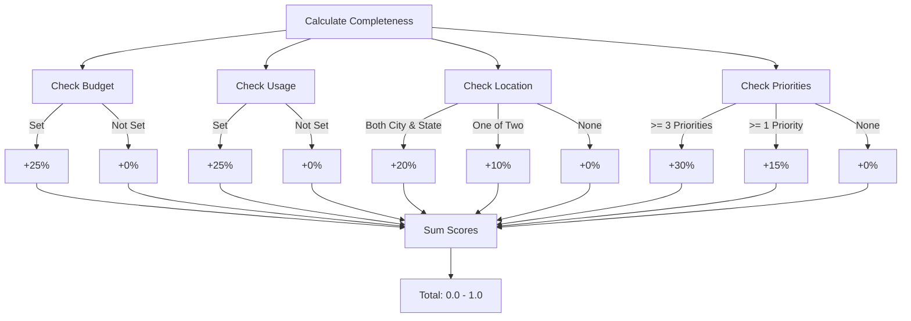
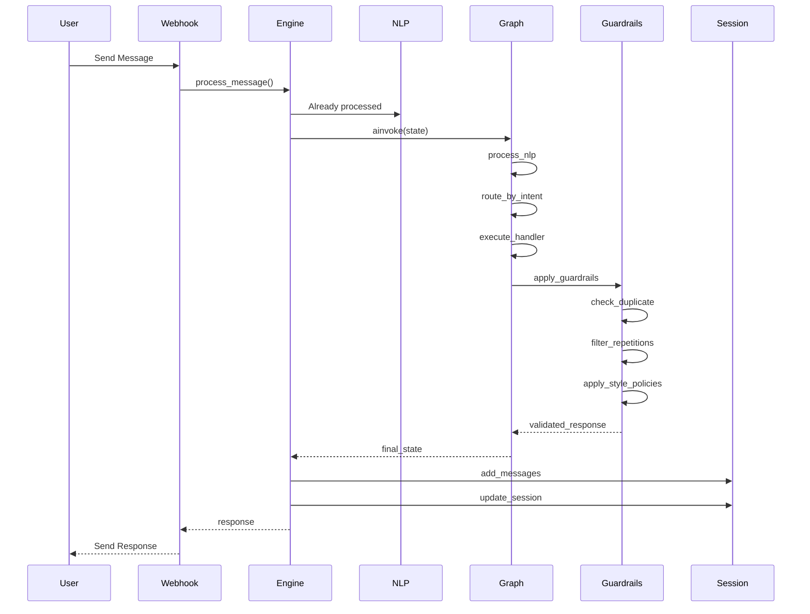
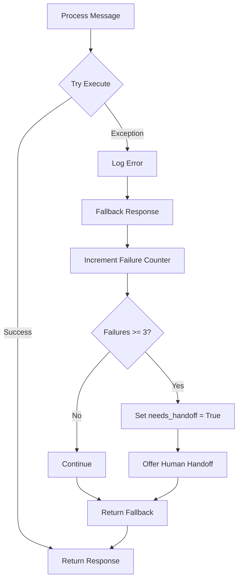

# Conversation Flow Diagram

## LangGraph State Machine

## Detailed Handler Flows

### 1. Handle Greeting Flow

### 2. Collect Profile Flow

### 3. Guardrails Validation Flow

## State Transitions

## Intent Routing Logic

## Guardrails Deduplication Logic

## Profile Completeness Calculation

## Message Processing Pipeline

## Error Handling Flow

## Key Features Illustrated

### 1. Progressive Profiling
- Asks questions one at a time
- Tracks completeness (0-100%)
- Adapts based on what's missing
- Shows summary when complete

### 2. Intelligent Routing
- Intent-based primary routing
- State-based fallback routing
- Handoff priority override
- Context-aware decisions

### 3. Quality Assurance
- Triple-layer validation (duplicate, repetition, style)
- Automatic reformulation
- Failure tracking
- Graceful degradation

### 4. State Persistence
- Checkpoints at each turn
- Session recovery
- Message history
- Context continuity

### 5. Error Recovery
- Try-catch at top level
- Fallback responses
- Failure counting
- Automatic handoff offer
